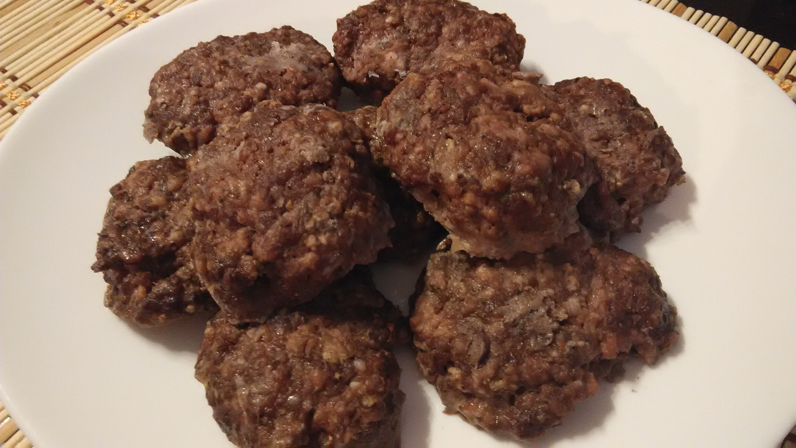

**Ingredience**

- 1 ks cibule
- sůl
- 3 stroužek česnek
- hladká mouka + na trojobal
- 1 ks vejce
- majoránka
- 1 rohlík
- 100 g slanina
- strouhanka
- pepř mletý
- 600 g mleté maso půl na půl hovězí a vepřové
- 400 ml mléko na namáčení rohlíků

**Postup**

1. Rohlík natrháme a namočíme do mléka. Po jeho rozmočení lehce vymačkáme a 2x (!) semeleme na masovém strojku spolu s masem, slaninou a cibulí. Poté přidáme ke směsi vejce, prolisovaný česnek, pepř, sůl a majoránku dle chuti. Pokud je směs příliš řídká, přidáme trochu mouky.
2. Tvoříme karbanátky, obalujeme v trojobalu a zvolna smažíme ve vyšší vrstvě tuku.

**Video**

<figure class="video_container">
  <iframe width="560" height="315" src="https://www.youtube.com/embed/WSexyQxiSRg" frameborder="0" allow="accelerometer; autoplay; encrypted-media; gyroscope; picture-in-picture" allowfullscreen></iframe>
</figure>
