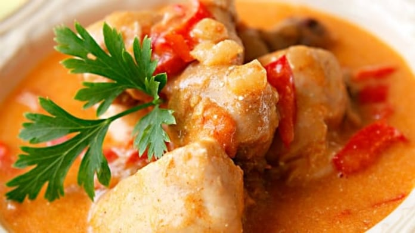

**Ingredience**

- kuře rozdělené na díly 1 kg
- sádlo 2 lžíce
- cibule 1 kus
- česnek 2 stroužky
- mletá sladká paprika 1 lžíce
- mletá pálivá paprika 1/2 lžíce
- vývar 3 dl
- hladká mouka 2 lžíce
- zakysaná smetana 4 dl
- rajče 1 větší
- sůl

**Postup**

1. Omyté a osušené díly kuřete pořádně osolte. Ve větším hrnci rozpalte sádlo a kuře na něm osmahněte dozlatova. Poté maso vyndejte a na vypečeném tuku osmahněte najemno nakrájenou cibuli, po chvíli přidejte i utřený česnek.
2. Hrnec sundejte z ohně, vmíchejte obě papriky a rychle přilijte vývar, aby paprika nezhořkla. Přiveďte k varu a nechte chvilku provařit. Vraťte do hrnce díly kuřete a pozvolna duste asi 30 minut. Když poté do masa píchnete nožem, maso by se mělo pomalu oddělovat od kosti.
3. Když je maso měkké, vyndejte ho z hrnce. Do omáčky vlijte směs smetany a mouky, kterou předem důkladně promíchejte. Povařte omáčku 8 minut a přidejte nadrobno nakrájené rajče. Vložte kuře do omáčky a ještě společně provařte 7–10 minut.
4. Podávejte nejlépe s domácími haluškami. Můžete ale použít i těstoviny nebo rýži.

**Video**

<figure class="video_container">
  <iframe width="560" height="315" src="https://www.youtube.com/embed/gjLt-eRtc7Y" frameborder="0" allow="accelerometer; autoplay; encrypted-media; gyroscope; picture-in-picture" allowfullscreen></iframe>
</figure>
