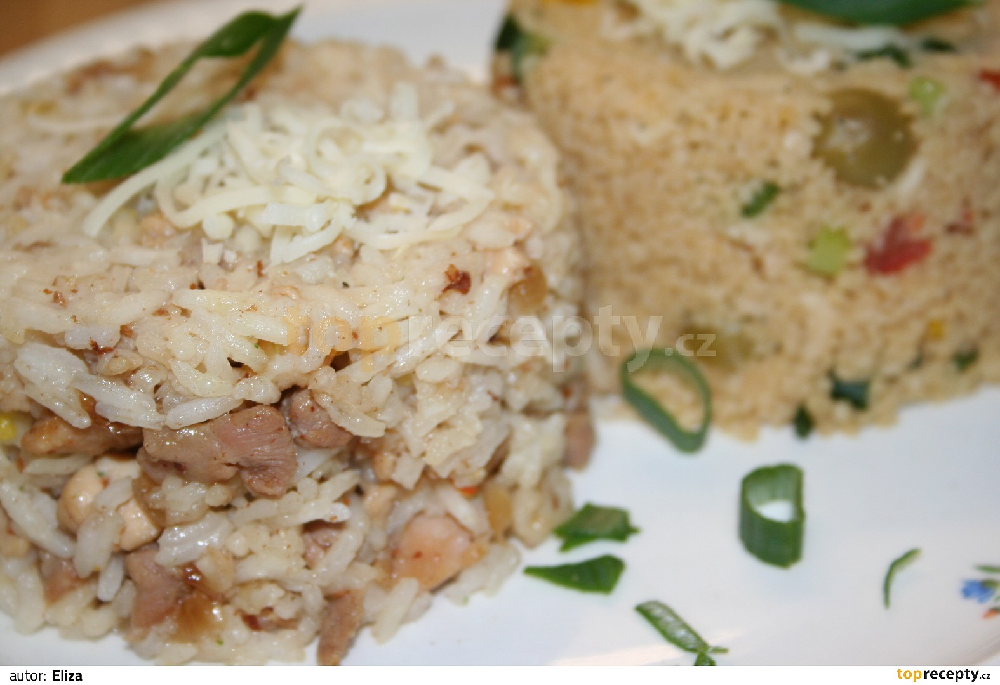

**Ingredience**

- 1 středně velká cibule
- 4 lžíce másla 300 g loupané rýže
- 3/4 l horkého zeleninového vývaru
- trocha soli
- 450 g kuřecího masa

**Postup**

1. Cibuli oloupeme a nakrájíme na kostičky.
2. Máslo (3 lžíce) zahřejeme ve velkém hrnci a cibulku v něm osmahneme. Přidáme rýži a mícháme tak dlouho, až se všechna zrnka potáhnou tukovým filmem (změní barvu).
3. Snížíme teplotu. Zalijeme trochou vývaru a mícháme, dokud rýže nenasaje tekutinu. Zatímco se směs vaří, postupně doléváme vývar. Pokaždé počkáme, až rýže vývar vsákne. Opatrně čas od času promícháme. Hotové rizoto dochutíme trochou soli.
4. V 1 lžíci másla opečeme na kostky nakrájené kuřecí maso, ochutíme ho pepřem, solí a vmícháme k rizotu. Dobrou chuť.

**Video**

<figure class="video_container">
  <iframe width="560" height="315" src="https://www.youtube.com/embed/VOBihHeZuXE" frameborder="0" allow="accelerometer; autoplay; encrypted-media; gyroscope; picture-in-picture" allowfullscreen></iframe>
</figure>
