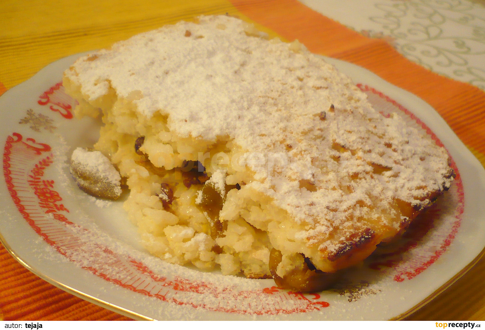

**Ingredience**

- 20 dkg oprané rýže
- 3/4 l mléka
- 5 dkg cukru
- 10 dkg másla
- 3 vejce
- 40 dkg odkapaného kompotovaného ovoce
- sůl
- 1 hrst hrozinek

**Postup**

1. Rýži uvaříme v mléce, které jsme osolili a osladili.
2. Do uvařené rýže, kterou vyklopíme na mísu, vmícháme za tepla 10 dkg másla a po vychladnutí přidáme 3 žloutky a sníh ze 3 bílků.
3. Polovinu hmoty vložíme do vymaštěného pekáče, na to položíme vrstvu odkapaného kompotovaného ovoce, pro vylepšení přidáme hrst hrozinek a přikryjeme zbytkem rýže.
4. Pečeme slabou hodinu.

**Video**

<figure class="video_container">
  <iframe width="560" height="315" src="https://www.youtube.com/embed/baRcUB7IqCY" frameborder="0" allow="accelerometer; autoplay; encrypted-media; gyroscope; picture-in-picture" allowfullscreen></iframe>
</figure>
