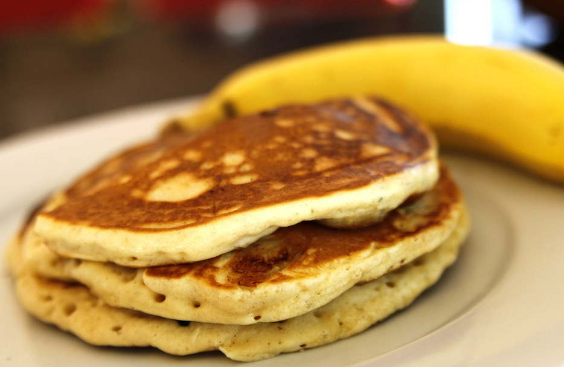

**Ingredience**

- banánCZ
- vejce
- vanilkový cukr
- ovesné vločky
- kokosový olej
- brusinky
- marmeláda

**Postup**

1. In a blender, combine the peeled banana, eggs, oats, baking powder and salt.
2. Allow to blend until the mixture is as smooth as you want it and blended well. Allow the batter to stand for 10-20 minutes until thickened slightly.
3. Heat a non-stick frying pan over medium heat.
4. Fry spoonfuls of the batter until golden brown on both sides.
5. Serve with a drizzle of maple syrup and fresh fruit of your choice.

**Video**

<figure class="video_container">
  <iframe width="560" height="315" src="https://www.youtube.com/embed/-DI0Nr3wPQA" frameborder="0" allow="accelerometer; autoplay; encrypted-media; gyroscope; picture-in-picture" allowfullscreen></iframe>
</figure>
