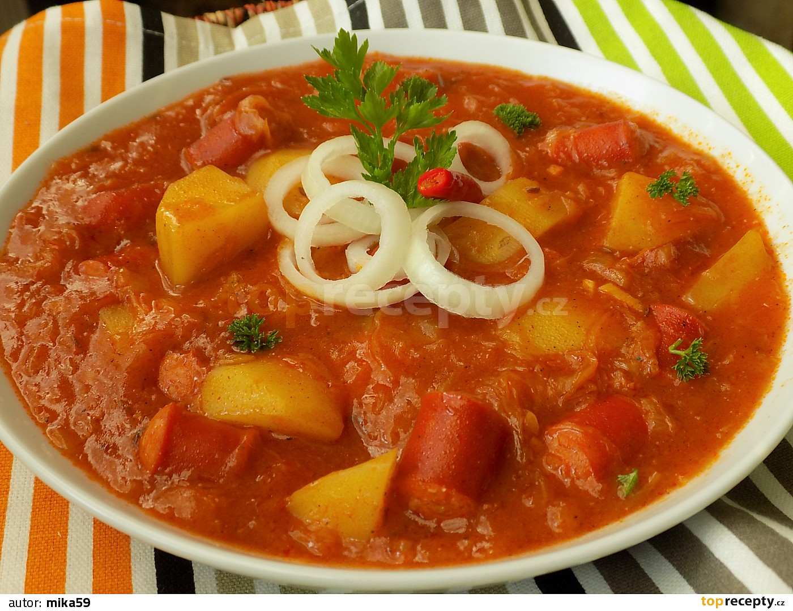

**Ingredience**

- 3 větší brambory
- 250 g kysaného zelí
- 250 g párků nebo klobásy
- 2 cibule
- 3 stroužky utřeného česneku
- lžíce sádla
- lžíce rajčatového protlaku
- červená mletá paprika
- 2 lžíce hladké mouky
- vývar nebo voda
- chilli pasta
- kmín
- sůl
- pepř

**Postup**

1. Brambory oloupeme a s uzeninou nakrájíme na větší kousky. Cibuli nakrájíme na drobno. Zelí vymačkáme a nakrájíme na menší kousky.
2. Cibuli na sádle usmažíme do zlaté barvy. Přidáme polovinu česneku, papriku, protlak a krátce orestujeme.
3. Zalijeme vývarem, přihodíme brambory a uzeninu.
4. Přisypeme koření a sůl a vaříme téměř do měkka. Zelí dáme do jiného hrnce, trochu podlijeme a dusíme cca 10 minut.
5. Do téměř měkkých brambor přidáme zelí a promícháme. Mouku rozmícháme v troše vody a přilijeme do vařícího základu.
6. Společně provaříme cca 10-15 minut. Dochutíme chilli, zbytkem česneku případně solí a pepřem. Podáváme s chlebem.
