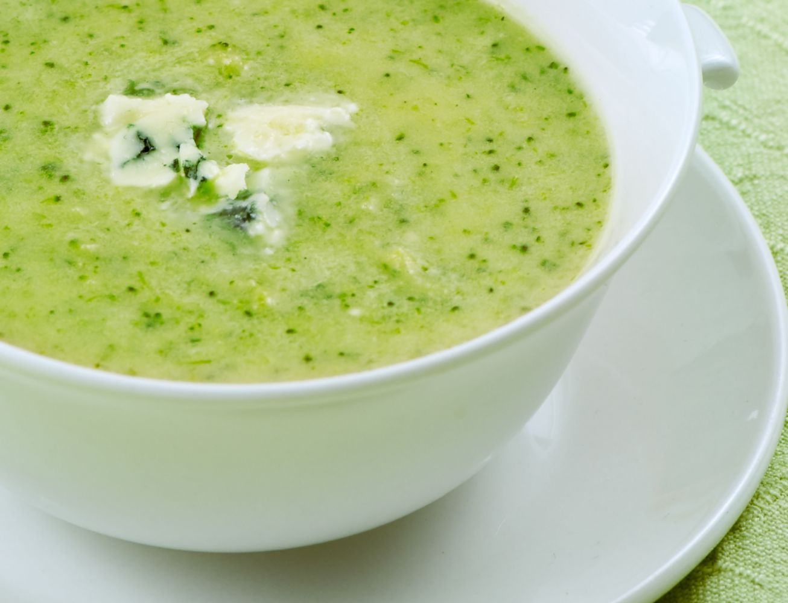

**Ingredience**

- 10g máslo
- sůl
- 1 stroužek česnek
- 100ml šlehačka
- pepř mletý
- 750g brokolice
- 1,5 kostka vývar
- muškátový oříšek

**Postup**

1. Brokolici očistíme, omyjeme a rozdělíme na růžičky, košťály oloupeme a nakrájíme na plátky. Česnek nasekáme a podusíme na rozpáleném tuku spolu s nakrájenými košťály.
2. Přilijeme vývar a povaříme na mírném ohni asi 5 minut. Přidáme růžičky brokolice a vaříme 10 minut.
3. Poté brokolici spolu s vývarem rozmixujeme. Za stálého míchání přidáme smetanu a dochutíme solí, pepřem a strouhaným muškátovým oříškem.
