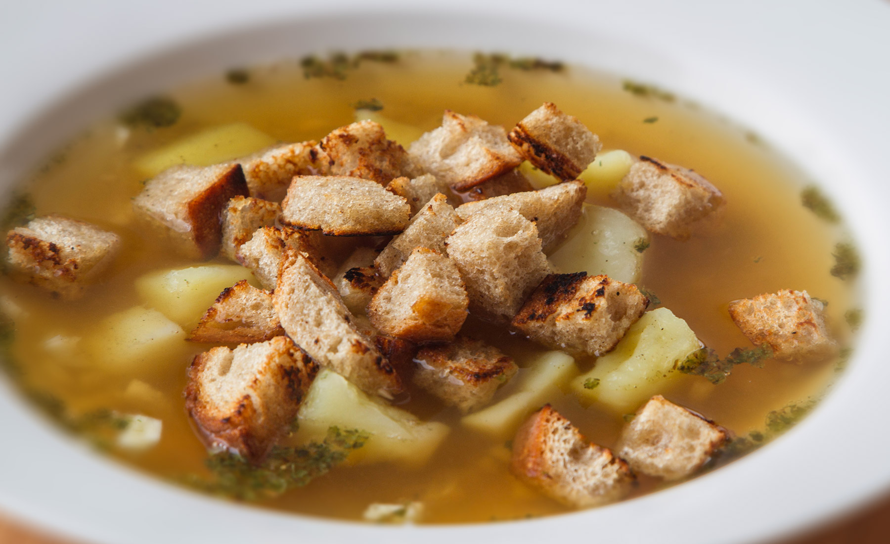

**Ingredience**

- 1,5l vody
- 2 ks středně velkých brambor
- 4 ks stroužků česneku
- 2 ks vajec
- 1 lžíce sádla
- mletý kmín
- majoránka
- sůl

**Postup**

1. Na sporák dáme v kastrolu vařit vodu, oloupeme brambory, opláchneme je a nastrouháme na hrubém struhadle přímo do hrnce
2. Mezi tím v hrnečku rozkvedláme vidličkou vajíčka
3. Do polévky dáme mletý kmín, sůl, rozetřený česnek a sádlo
4. Jakmile nám začne polévka vařit, tak jsou brambory už měkké a do polévky nalévám vejce za současného míchání polévky
5. Vejce okamžitě tuhne a tak polévku odstavíme ze sporáku, po té do ní přidáme majoránku a můžeme podávat.
