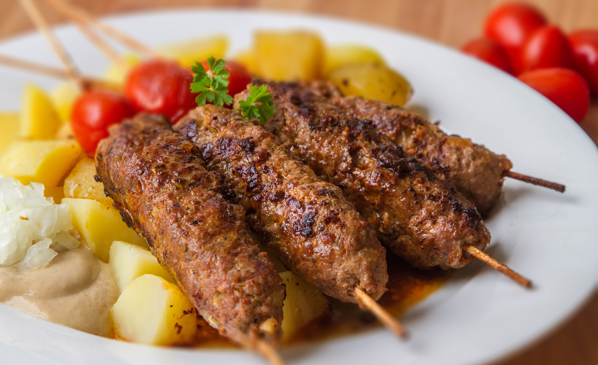

**Ingredience**

- 1 ks cibule větší
- 1 špetka sůl
- 3 stroužek česnek větší
- 1 ks vejce
- rostlinný olej na smažení
- 1 špetka majoránka
- 1 špetka pepř mletý
- 0,5 kg mleté maso
- 1 lžička paprika - sladká
- 1 špetka chilli papričky

**Postup**

1. Do mletého masa přidáme nadrobno nakrájenou cibulku, prolisovaný česnek, papriku, chilli, celé vajíčko, opepříme, osolíme a vše hodně důkladně prohněteme. V případě, že je směs řídší, přidáme trochu strouhanky, abychom docílili požadované tuhosti směsi. Ze vzniklé směsi uděláme malé válečky (asi tak velikosti palce).
2. Na pánvi rozpálíme větší množství oleje na vysokou teplotu a válečky v něm zprudka opečeme tak, aby střed zůstal mírně načervenalý. Před vložením do rozpáleného oleje možno poprášit hladkou moukou.
3. Podáváme s hořčicí, najemno nakrájenou cibulkou, syrovou zeleninou. Vhodná je i tatarská omáčka.
4. Příloha: vařené brambory, hranolky.
