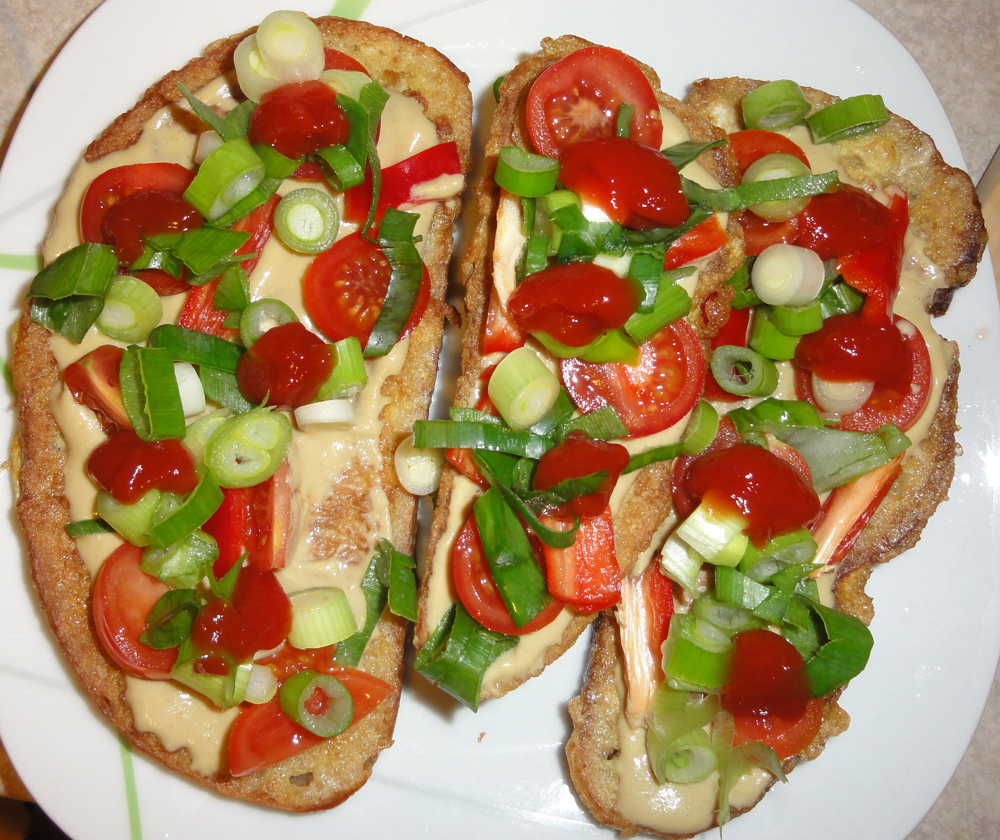

**Ingredience**

- 8 plátek chleba starší
- 3 ks vejce
- 1 špetka sůl
- 100 g salám
- 3 ks rajče
- 1 ks cibule
- 2 ks okurka čerstvá a kyselá
- 8 lžička hořčice
- 100 g sýr hermelín nebo jiný, i tavený
- rostlinný olej na smažení

**Postup**

Na pánvi rozpálíme olej, vejce rozkloktáme v hlubokém talíři, osolíme a z obou stran v nich rychle námáčíme přepůlené plátky chleba. Ihned smažíme do zlatova a dáme na ubrousek odsát přebytečný tuk. Pak osmažený chléb pomažeme horčicí a poklademe vším, co máme rádi. A nebojíme se kombinovat a dát prostě od všeho něco...

**Video**

<figure class="video_container">
  <iframe width="560" height="315" src="https://www.youtube.com/embed/f-cqC7aTVhw" frameborder="0" allow="accelerometer; autoplay; encrypted-media; gyroscope; picture-in-picture" allowfullscreen></iframe>
</figure>
