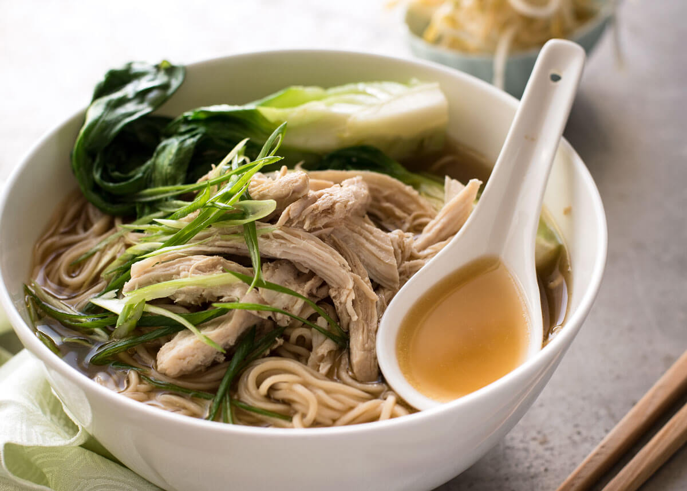

**Ingredience**

BROTH

- 3 cups / 750 ml chicken broth
- 2 garlic cloves, smashed
- 1/3" / 1 cm piece of ginger, sliced (optional, but highly recommended)
- 1 1/2 tbsp light soy sauce (or normal all purpose soy sauce)
- 2 tsp sugar (any)
- 1½ tbsp chinese cooking wine
- 1/4 - 1/2 tsp sesame oil

  TOPPINGS & NOODLES

- 6 oz / 180g fresh egg noodles
- 2 large bok choy plus/or other vegetables of choice
- 1 cup shredded cooked chicken (or other protein of choice)
- 1 scallion / shallot, green part only finely sliced (optional garnish)

**Postup**

1. Place Broth ingredients in a saucepan over high heat. Place lid on, bring to simmer then reduce to medium high and simmer for 5 - 10 minutes to allow the flavours to infuse.
2. Meanwhile, cook noodles according to packet directions.
3. Cut vegetables to desired size. For bok choy, cut them into quarters (cut a cross into the base and tear it into neat quarters with your hands).
4. Pick ginger and garlic out of soup broth. Add buk choi and cook for 1 minute. Add chicken then turn the stove off.
5. Place noodles in bowls. Divide soup and toppings between bowls. Garnish with shallots if using. Great served with chilli paste or fresh chillis.

**Video**

<figure class="video_container">
  <iframe width="560" height="315" src="https://www.youtube.com/embed/SqLsdGqzTJ8" frameborder="0" allow="accelerometer; autoplay; encrypted-media; gyroscope; picture-in-picture" allowfullscreen></iframe>
</figure>
