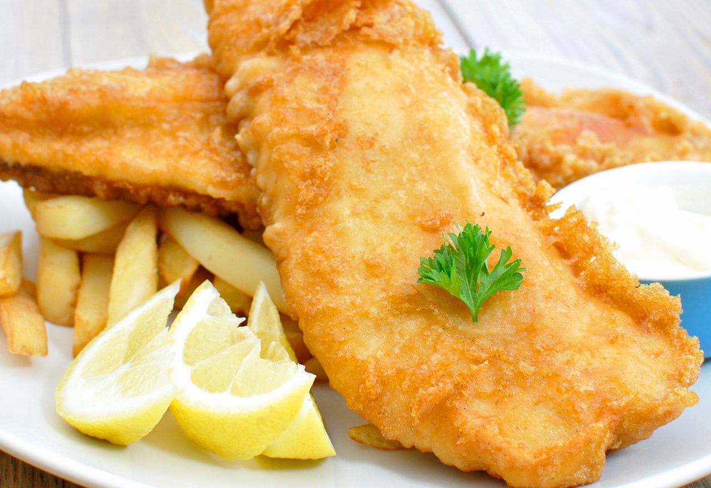

**Ingredience**

- 6 large russet potatoes, peeled and sliced into 1/2-inch strips/fries
- Canola oil, for frying
- 1 1/2 cup all-purpose flour, divided
- 1 tablespoon salt, divided
- 1 teaspoons ground black pepper
- 1 teaspoon garlic powder
- 1 cup beer (lager or ale)
- cold water as needed
- 1 1/2 pounds skinless cod fillets (or haddock), cut to preferred size
- kosher salt

**Postup**

1. Begin by "pre-frying" the chips (fries). They will be fried twice. Add 3-inch depth of oil to a large pot heavy bottomed pot or Dutch oven. Heat oil to 325-degrees F.
2. Carefully add chips (fries) to hot oil, working in batches as needed to avoid overcrowding. Fry the chips for 3 minutes, drain and spread out on paper towel lined baking sheet. (Again, please note: chips are not fully done at this stage.)
3. Prepare the fish by mixing 1/2 cup of flour, 1 teaspoon salt and black pepper in a shallow bowl or dish; set aside.
4. In a separate bowl, whisk together the remaining 1 cup of flour, 2 teaspoons salt, and 1 teaspoon garlic powder. Gradually whisk in beer until smooth. (Batter should be consistency of thick cream. If batter is too thick, gradually stream in cold water 1 tablespoon at a time; if it’s too thin sprinkle in more flour 1 teaspoon at a time until it thickens up to correct consistency.)
5. Increase oil temperature to 375-degrees F.
6. Dredge fish in dry flour mixture. Tap off excess. Dip fish in beer batter, allow excess to drain off.
7. Working in batches, carefully add battered fish and the "pre-fried" chips to oil and cook until golden brown, approximately 5-7 minutes.
8. Transfer cooked fish and chips to paper towel lined baking sheets or cooling rack. Sprinkled with kosher salt while still warm.
9. Serve with malt vinegar and/or tartar sauce.

NOTES
Lightly coat fish in flour before battering to help batter stick better. Use a handy dandy Candy/Deep Fry Thermometer. Don’t try to estimate. Use a thermometer and know for sure that the oil is hot enough for frying. Avoid crowding the pot. Not only does adding a bunch to hot oil all at once lower the overall temperature of the oil but the food can begin to bunch and stick together. Drain excess oil. Prepare paper towel lined baking sheet or cooling rack to allow food to drain off excess oil while cooling.
