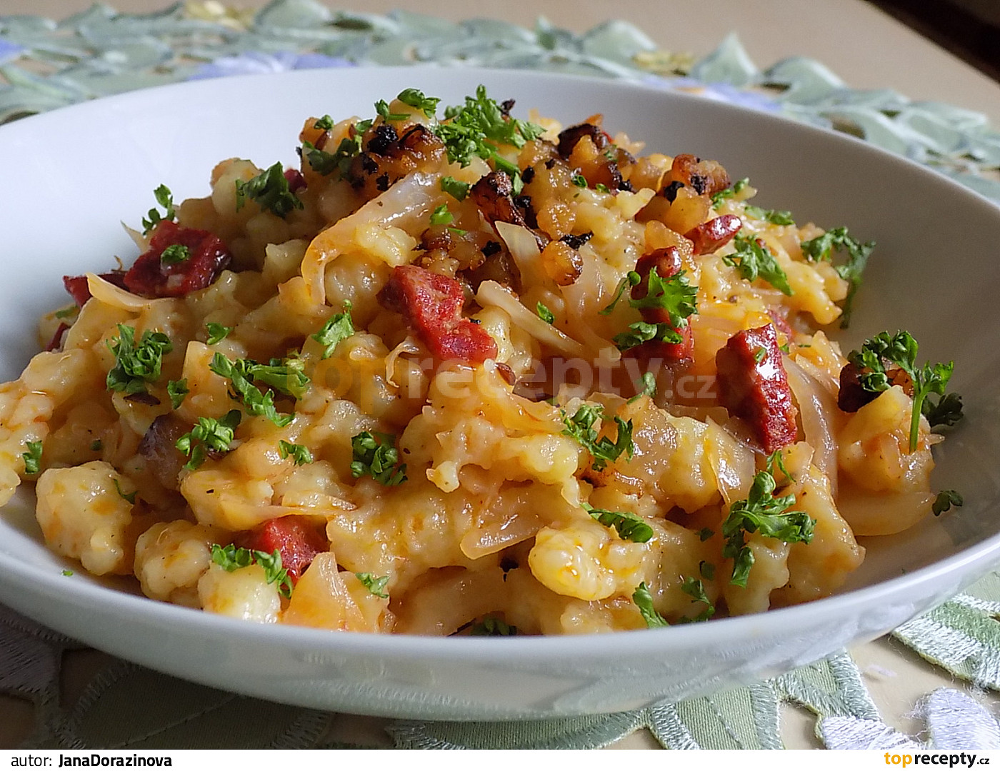

**Ingredience**

- 750 g brambory
- 400 g kysané zelí
- 200 g uzená slanina
- 250 g polohrubá mouka
- sůl

**Postup**

1. Slaninu nakrájíme na kostičky, rozškvaříme s lžící oleje, přidáme kysané zelí, osolíme (můžeme i jemně opepřit) a podusíme 10-15 minut.
2. Brambory nastrouháme, osolíme a dobře promícháme s moukou.
3. Do vroucí osolené vody hážeme halušky přes speciální cedník (nebo přes struhadlo s velkými otvory).
4. Opatrně jednou promícháme.
5. Když halušky vyplavou na povrch, scedíme je.
6. Halušky promícháme se zelím a podáváme.

**Video**

<figure class="video_container">
  <iframe width="560" height="315" src="https://www.youtube.com/embed/91FKWqBlotA" frameborder="0" allow="accelerometer; autoplay; encrypted-media; gyroscope; picture-in-picture" allowfullscreen></iframe>
</figure>
