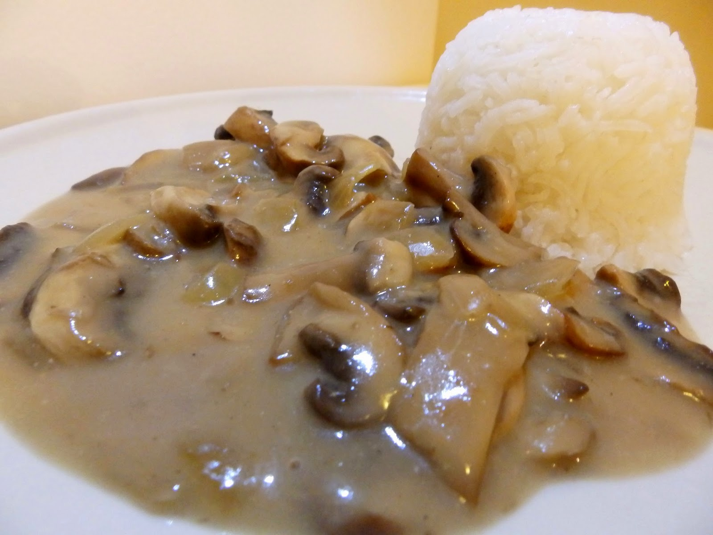

**Ingredience**

- 3 lžíce hladká mouka
- 3 lžíce rostlinný olej
- 100 g čerstvé houby
- 10 g sušené houby
- 1 ks cibule
- 1 špetka pepř mletý
- 1 špetka sůl
- 700 ml vepřový vývar

**Postup**

1. Nakrájenou cibuli dozlatova osmažíme na části tuku, zasmahneme moukou, zalijeme vývarem a rozšleháme. Přidáme sůl, pepř a zvolna vaříme asi 30 minut. Na zbývajícím tuku osmahneme plátky očištěných a nakrájených čerstvých hub a provařenou omáčku do nich přecedíme. Pokud jsme použili houby sušené, uvaříme je v malém množství vody nebo vývaru. Vývar přidáme spolu s překrájenými houbami do omáčky a krátce spolu povaříme.
