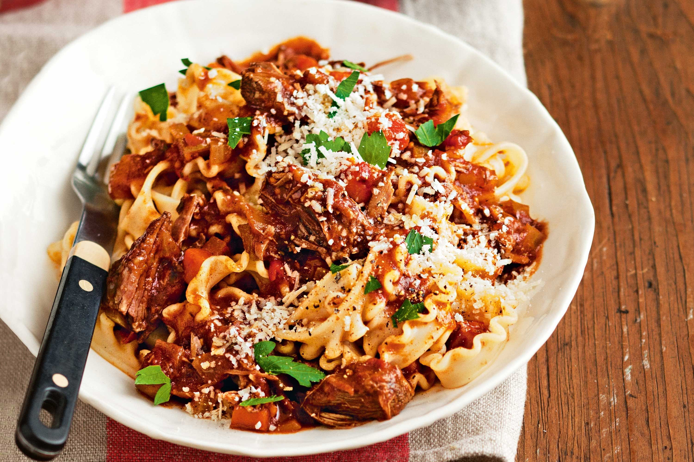

**Ingredience**

- 1.2kg / 2.5 lb chuck beef or other slow cooking beef cut, cut into equal 4 pieces
- 1 tbsp salt
- Black pepper
- 3 tbsp olive oil , separated
- 3 cloves garlic , minced
- 1 onion , diced
- 1 cup carrots , diced
- 1 cup celery , diced
- 800g / 28oz crushed canned tomatoes
- 3 tbsp tomato paste
- 2 beef bouillon cubes , crumbled
- 1 cup / 250ml red wine , full bodied (like merlot, cabernet sauvignon), or sub with beef broth/stock
- 1 1/2 cups / 375 ml water
- 3/4 tsp dried thyme or 3 sprigs fresh thyme
- 3 dried bay leaves

TO SERVE (NOT ALL SAUCE IS USED)

- 1 lb /500g dried pappardelle , or other pasta of choice
- Freshly grated parmesan cheese or parmigiano reggiano
- Fresh parsley , finely chopped (optional)

**Postup**

1. Pat beef dry and sprinkle with salt and pepper
2. Sear Beef: Heat 1 tbsp olive oil over high heat in a heavy based pot. Add beef and sear each piece aggressively on all sides until very browned (3 - 5 minutes in total), then remove onto a plate.
3. Turn stove down to medium low and add remaining 2 tbsp of olive oil.
4. Soffrito: Add garlic and onion and sauté for 2 minutes. Then add the carrots and celery and sauté slowly for 5 minutes.
5. Add remaining Ragu ingredients and return the beef to the pot (including pooled juices). Turn the stove up and bring it to a simmer, then turn it down to low so it's bubbling very very gently. (Note 7)
6. Slow cook: Cover the pot and let it cook for 2 hours or until beef is tender enough to shred. (Note 5 for slow cooker and pressure cooker).
7. Shred: Remove beef then coarsely shred with 2 forks. Return beef to the pot. Simmer for 30 minutes until sauce is reduced and thickened - beef will soften slightly more during this step.
8. Final season: Do a taste test and adjust the seasoning to your taste with salt and pepper. ALSO, add 1/2 tsp sugar if sauce is a bit sour for your taste (Note 6). Place the lid on and set aside until ready to serve (it's even better the next day and freezes well for months!).

**Video**

<figure class="video_container">
  <iframe width="560" height="315" src="https://www.youtube.com/embed/ChzUN_RvMeY" frameborder="0" allow="accelerometer; autoplay; encrypted-media; gyroscope; picture-in-picture" allowfullscreen></iframe>
</figure>
