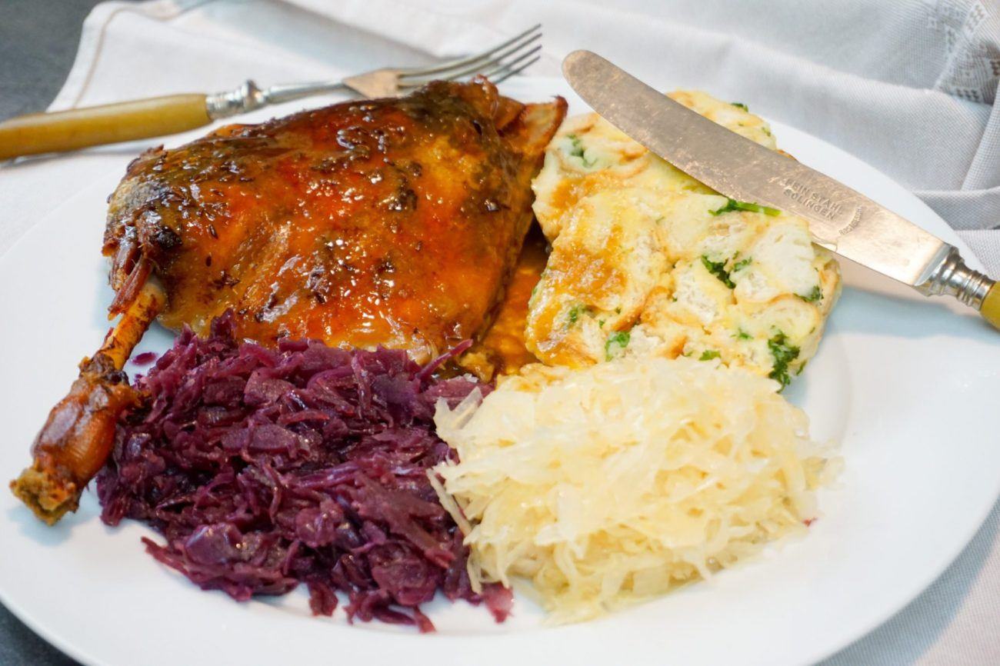

**Ingredience**

KACHNÍ STEHNA

- 6 kachní stehna
- 1 cibule
- 1 lžička olej
- 1 lžička hladká mouka
- kmín
- sůl

ČERVENÉ ZELÍ

- 1 sterilované červené zelí
- 1 malá cibule
- dle chuti cukr krupice
- dle chuti sůl
- olej
- KYSANÉ ZELÍ
- 1 kysané zelí
- 1 malá cibule
- dle chuti cukr krupice
- dle chuti sůl
- olej

KARLOVARSKÝ KNEDLÍK

- 6 rohlík
- 3 vejce
- 50 g máslo
- 180 ml mléko
- 70 g hrubá mouka
- 2 hrsti hladkolistá petrželka
- muškátový květ
- špetka sůl

**Postup**

1. Cibuli nakrájíme nadrobno a nasypeme do většího pekáčku vytřeného olejeme. Stehna očistíme od případného peří, opláchneme, osušíme, z obou stran osolíme, pokmínujeme a poskládáme do pekáčku. Nejdřív kůží dolů. Přiklopíme pokličkou nebo alobalem a vložíme do trouby vyhřáté na 120 st. C a pečeme 3 hodiny. Potom stehna obrátíme, znovu přiklopíme a pečeme další 2 hodiny. Za tu dobu stehna pustí spoustu tuku. Asi hodinu před podáváním stehna přendáme "nasucho" do jiného pekáčku, teplotu zvýšíme na 160 st. C a už bez zakrytí opečeme dozlatova. Část tuku slijeme do malého kastrolku, zahřejeme a zahustíme troškou mouky. Chvilku smažíme a doředíme případným výpekem, který ještě pustí stehna.
2. V mezičase si připravíme ostatní. Rohlíky nakrájíme na kostičky, jsou-li moc měkké, necháme chvilku okorat na pánvi nebo v troubě. Žloutky smícháme s rozpuštěným máslem, kořením, solí a vlažným mlékem. Rohlíky posypeme hrubou moukou a posekanou petrželkou a přelijeme tekutou směsí. Promísíme. Bílky se špetičkou soli ušleháme do polotuha a smícháme s rohlíky. Směs rozdělíme na 3 části. Každou naneseme na kus fresh fólie a zabalíme, vytvarujeme váleček a konce zavážeme bílou nití jako bonbon. Vložíme do vroucí vody a vaříme 18 minut. Uvařené knedlíky necháme chvíli vydýchat, rozbalíme a bílou nití nakrájíme na plátky.
3. Připravíme také zelí. Každé ve svém kastrolu. Na dno kápneme trochu oleje a přisypeme posekanou cibuli. Necháme zpěnit. Ze zelí slijeme nálev, raději si ho uschováme ve skleničce na případné dochucení. Kysané ochutnáme a pokud bude hodně kyselé, radši propláchneme čistou vodou (ovšem někdo hodně kyselé rád :D). Zelí vyklopíme na orestovanou cibuli, přiklopíme pokličkami a udusíme doměkka. Dochutíme solí a cukrem.

**Video**

<figure class="video_container">
  <iframe width="560" height="315" src="https://www.youtube.com/embed/m2lFw1Pzo_M" frameborder="0" allow="accelerometer; autoplay; encrypted-media; gyroscope; picture-in-picture" allowfullscreen></iframe>
</figure>
