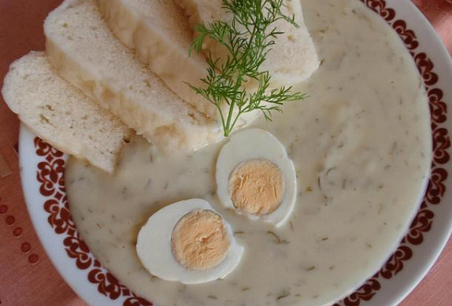

**Ingredience**

- 70 g máslo
- 1 lžička sůl
- 70 g hladká mouka
- ocet dle chuti, přidáváme po lžičkách
- 20 g kopr čerstvý, drobně nasekaný
- 1 lžíce olej
- 1 l mléko polotučné nebo tučné
- 60 g cukr krupice dle chuti

**Postup**

1. V hrnci si na lžíci oleje necháme rozpustit máslo, které zaprášíme moukou a za stálého míchání usmažíme světlou jíšku. K jíšce za stálého míchání přilijeme mléko, dobře rozmícháme, přivedeme k varu, přidáme sůl, cukr a necháme cca 5 minut provařit, ke konci vaření přidáme kopr a po lžičkách dle chuti ocet (cca 4-5 lžiček).
2. Podáváme s houskovým knedlíkem nebo bramborem, vařeným vejcem nebo plátkem vařeného (dušeného) hovězího (vepřového) masa.

**Video**

<figure class="video_container">
  <iframe width="560" height="315" src="https://www.youtube.com/embed/3stznSFiBso" frameborder="0" allow="accelerometer; autoplay; encrypted-media; gyroscope; picture-in-picture" allowfullscreen></iframe>
</figure>
