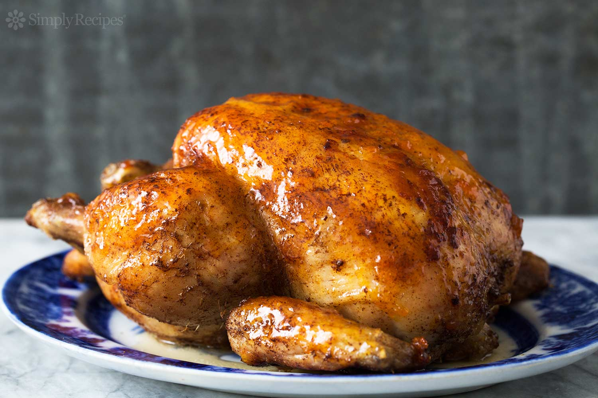

**Ingredience**

- 1 (3 pound) whole chicken, giblets removed
- salt and black pepper to taste
- 1 tablespoon onion powder, or to taste
- ½ cup margarine, divided
- 1 stalk celery, leaves removed

**Postup**

1. Preheat oven to 350 degrees F (175 degrees C).
2. Place chicken in a roasting pan, and season generously inside and out with salt and pepper. Sprinkle inside and out with onion powder. Place 3 tablespoons margarine in the chicken cavity. Arrange dollops of the remaining margarine around the chicken's exterior. Cut the celery into 3 or 4 pieces, and place in the chicken cavity.
3. Bake uncovered 1 hour and 15 minutes in the preheated oven, to a minimum internal temperature of 180 degrees F (82 degrees C). Remove from heat, and baste with melted margarine and drippings. Cover with aluminum foil, and allow to rest about 30 minutes before serving.

**Video**

<figure class="video_container">
  <iframe width="560" height="315" src="https://www.youtube.com/embed/OETLkPgt_pw" frameborder="0" allow="accelerometer; autoplay; encrypted-media; gyroscope; picture-in-picture" allowfullscreen></iframe>
</figure>
