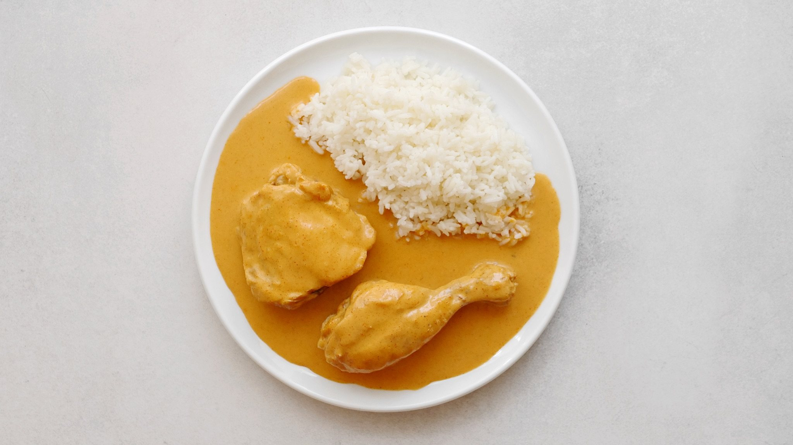

**Ingredience**

- 1 kg kuřecích stehen (59 Kč)
- 2 cibule (4,90 Kč)
- 500 ml vývaru (15 Kč)
- 250 ml smetany (30 % tuku, 21,90 Kč)
- 2 lžíce oleje (0,80 Kč)
- 2 lžíce mouky (0,40 Kč)
- 1 lžíce másla (3 Kč)
- 1 lžíce sladké mleté papriky (2,50 Kč)
- sůl, pepř

**Postup**

1. Kuřecí stehna rozdělte v kloubu na poloviny. Dobře osolte ze všech stran a nechte odležet v lednici (klidně i přes noc). Maso po odležení dobře osušte papírovým ubrouskem. Cibuli oloupejte a nasekejte nadrobno.
2. V kastrolu rozehřejte olej. Vložte díly kuřete kůží dolů a zprudka je orestujte dozlatova. Otočte a to samé i na druhé straně. Pokud se vám nevejdou najednou – klidně na dvě nebo tři várky.
3. Kuře vyjměte a dejte stranou. Přidejte lžíci másla a nasekanou cibuli. Zmírněte trochu plamen a pomalu nechte cibuli zesklovatět (8 až 10 minut, ale ne zase, aby chytila výraznou barvu). Přidejte mouku s mletou paprikou a krátce zasmahněte.
4. Zalijte horkým vývarem a promíchejte. Vložte všechny díly kuřete a dejte na mírný plamen pomalu táhnout (asi 45 až 60 minut). Měkké maso vyjměte – podle preferencí jej už můžete obrat. Přidejte smetanu a rozmixujte dohladka. Maso vraťte a nechte ještě chvíli v omáčce dojít.
