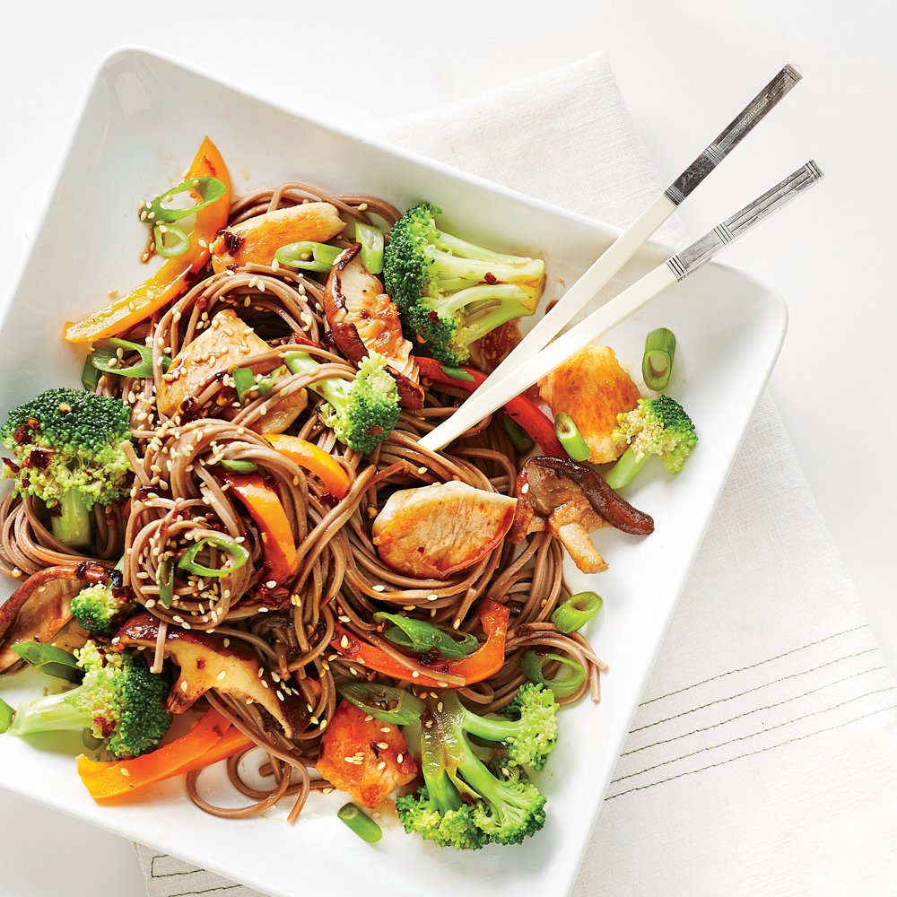

**Ingredience**

Main

- 2 packs udon noodles (440g/15.5 ounces) (or your choice of noodles)
- 300g/10.5 ounces skinless chicken thigh fillets, chopped into small pieces
- 1 broccoli (280g/9.8 ounces), florets separated and cut into even sized pieces
- 1/2 small (45g/1.6 ounces) red bell pepper, julienned
- 1 tsp roasted sesame seeds
- Some cooking oil (I use rice bran oil)

Sauce (Mix these in a bowl)

- 2 Tbsp oyster sauce
- 2 Tbsp soy sauce
- 2 Tbsp honey
- 1 tsp minced garlic
- 2 tsp sesame oil

**Postup**

1. Marinate the chopped chicken in the sauce (while the other ingredients are getting prepared) and set aside. Heat a pan/skillet on medium-high heat and once heated add some cooking oil and spread it thinly. Add the chicken (and any remaining marinade) and cook until 60% of the meat is cooked (about 5 mins). Stir occasionally.
2. Boil the udon noodles per the manufacturer’s instructions. Drain the water. Set aside. (Ideally, step 1 and step 2 should start at the same time so that you use the fresh, warm and not sticky noodles.)
3. Add the broccoli and the red bell peppers into the skillet and stir. Cook until the chicken is nearly (98%) cooked. Add the boiled udon noodles and stir occasionally. Once the chicken is fully cooked, garnish with the sesame seeds then serve.
