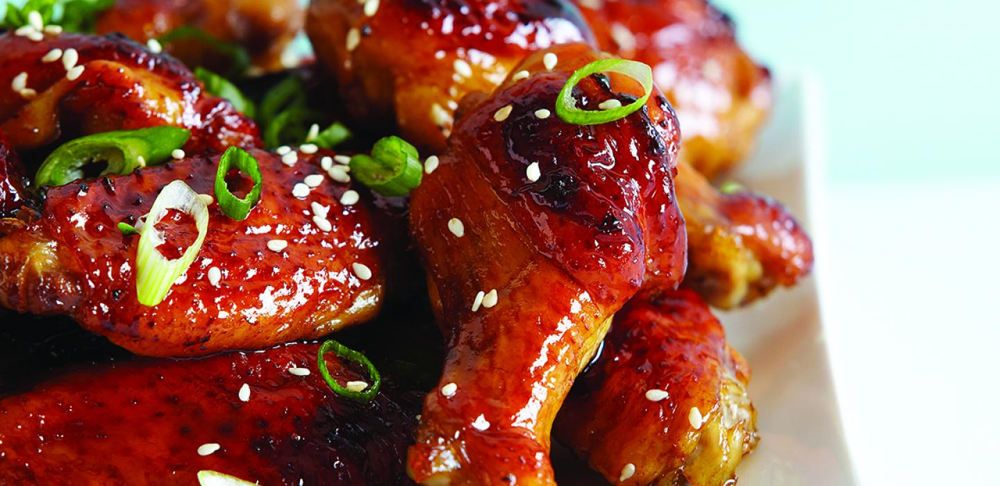

**Ingredience**

- 2 tablespoons baking powder
- 1 tablespoon kosher salt
- 1 teaspoon freshly ground black pepper
- 1 teaspoon smoked paprika
- 2 ½ pounds chicken wing sections

Honey Sriracha Glaze:

- ⅓ cup honey
- ⅓ cup sriracha sauce
- 1 tablespoon seasoned rice vinegar
- ¼ teaspoon sesame oil
- 1 pinch sesame seeds, or as desired

**Postup**

1. Preheat oven to 425 degrees F (220 degrees C). Line a baking sheet with aluminum foil and place an oven-proof wire rack over the foil.
2. Whisk baking powder, salt, black pepper, and paprika together in a small bowl. Place chicken wings in a large bowl. Sprinkle 1/2 of the baking powder mixture over wings and toss to coat. Sprinkle remaining baking powder mixture over wings and toss to coat again. Place wings onto the rack of the prepared baking sheet.
3. Bake in the preheated oven for 20 minutes. Turn wings and continue baking for 20 minutes. Turn wings again and bake until wings are browned and crispy, about 15 minutes more. Transfer wings to a large bowl.
4. Whisk honey, sriracha sauce, rice vinegar, and sesame oil together in a bowl until glaze is smooth. Drizzle glaze over wings and toss to coat completely. Transfer wings to a serving platter and sprinkle sesame seeds over the top.
