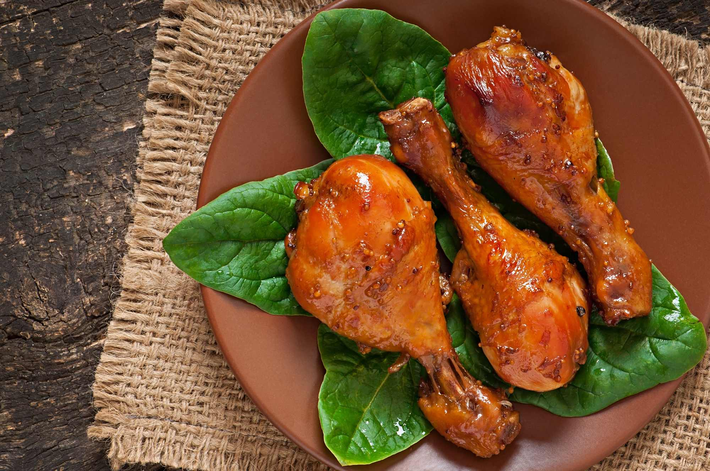

**Ingredience**

KUŘE:

- kuřecí paličky 1 kg
- rostlinný olej 250 ml
- sójová omáčka 1 lžíce
- med 2 lžíce
- sladká paprika 1 lžička
- česnek 1 stroužek
- sůl a čerstvě namletý pepř
  RATATOUILLE:
- lilek 1 ks
- velká rajčata 2 ks
- střední cuketa 1 ks
- zelená paprika 1 ks
- červená paprika 1 ks
- extra panenský olivový olej 10 lžic
- řajčatový protlak 100 g
- bílé vino 120 ml
- čerstvá bazalka 1 hrst
- sůl a čerstvě namletý pepř

**Postup**

1. KUŘE: Kuřecí paličky omyjte a osušte. Mezitím si připravte marinádu: v míse smíchejte olej, sójovou omáčku, med a papriku, prolisujte do směsi česnek, nakonec vše osolte a opepřete podle chuti a vložte do marinády maso. Mísu přikryjte potravinářskou fólií a dejte odležet do lednice alespoň na 2 hodiny, ale klidně i přes noc.
2. Předehřejte horkovzdušnou troubu na horní i spodní ohřev na 190 °C.
3. Naložené maso přendejte do pekáčku, lžící vyškrábněte usazený med a pečlivě jím maso potřete. Dejte ho péct na 20 minut, pak paličky obraťte a pečte dalších 20 minut. Servírujte s ratatouille nebo jinou přílohou dle vašeho výběru.
4. RATATOUILLE: Předehřejte horkovzdušnou troubu na horní i spodní ohřev na 180 °C.
5. Všechnu zeleninu omyjte. Lilek nakrájejte na malé kousky, rajčata a cuketu na měsíčky, papriky zbavte středu a nakrájejte na proužky.
6. Všechnu zeleninu dejte do pekáče, zakápněte olivovým olejem, zalijte rajčatovým protlakem a bílým vínem, přidejte nasekanou bazalku a osolte a opepřete podle chuti. Pekáč přikryjte poklopem nebo alobalem a dejte asi na 1 hodinu do trouby. Po hodině pekáč odklopte a nechte v troubě dalších 5 minut.
