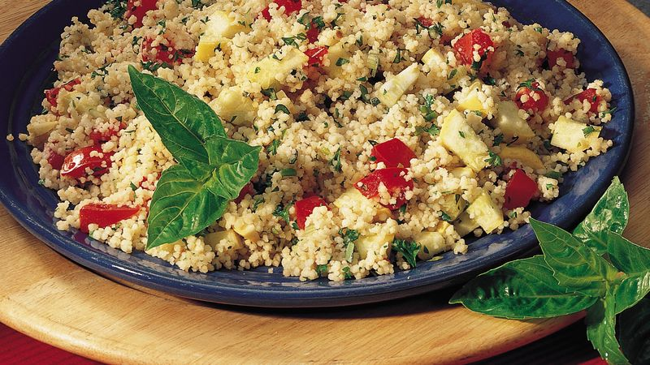

**Ingredience**

- 250 g couscous
- 1 teaspoon ground cumin
- 1 teaspoon smoked paprika
- sea salt
- freshly ground black pepper
- 1 medium red onion , peeled
- 1 medium cucumber
- 2 ripe tomatoes
- 1 fresh red chilli
- 1 bunch of fresh mint , leaves picked
- ½ bunch of fresh coriander , leaves picked
- 1 bunch of fresh flat-leaf parsley
- 1 tablespoon tomato purée
- 2 tablespoons extra virgin olive oil
- ½ unwaxed lemon , zest and juice from

**Postup**

1. Place the couscous, cumin, paprika and a big pinch of salt into a bowl. Stir to combine, then pour over just enough boiling water to cover the couscous. Cover the bowl and leave for about 10 minutes.
2. Meanwhile, finely chop the onion, cucumber, tomatoes and chilli (I leave the seeds in, but deseed if you prefer). Finely chop the mint and coriander leaves, and the parsley (including the stalks).
3. Mix the couscous up with a fork, then stir in the tomato purée until well coated (I do this with my hands – it’s messy, but quite therapeutic!). Add all the chopped vegetables, chilli and herbs and mix well. Stir in the oil and the lemon zest and juice, then season to how you like it. Serve as a side with grilled meat or fish or eat it on its own if you want a light meal or snack.
