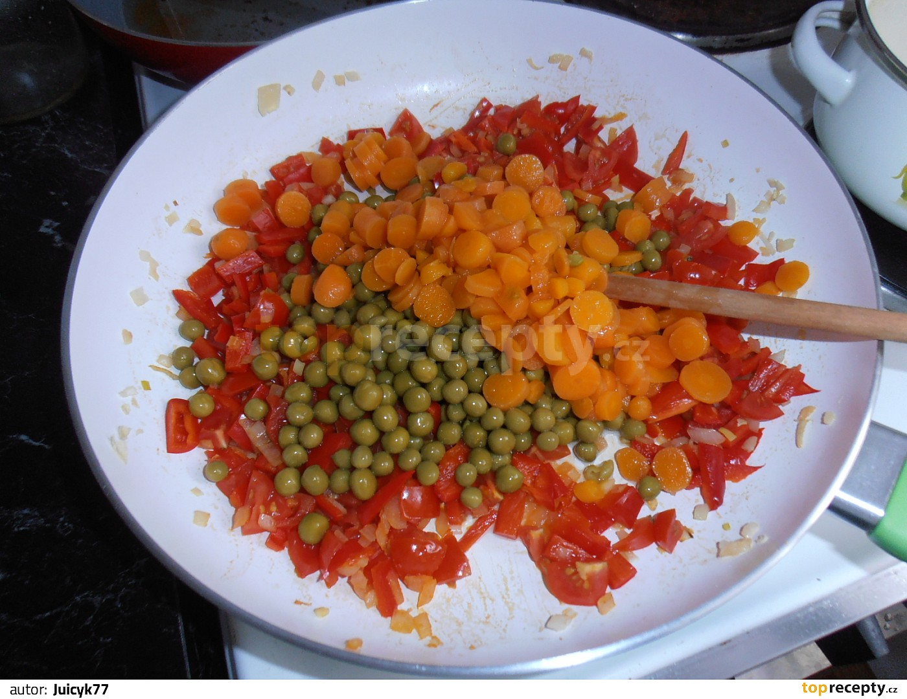

**Ingredience**

- 2 šálky celozrnného kuskusu
- 4 šálky vývaru
- 1 větší cibule
- 2 čerstvé papriky (červená, zelená)
- 7 ks cherry rajčátek plechovka sterilovaného hrášku s mrkví
- 2 stroužky česneku
- olivový olej
- kari koření
- sůl (nejlépe bylinková)
- pepř

**Postup**

1. Pokud máme domácí vývar, necháme ho prohřát. Pokud ne, vypomůžeme si vývarem z kostky. Kuskus si dáme do nějaké podlouhlé nádoby (ve vysoké míse se pak spodní vrstva kuskusu zbytečně slepí), zalijeme horkým vývarem (ne vroucím), přikryjeme a necháme pár minut odstát.
2. Mezitím si na hluboké pánvi rozehřejeme olivový olej, cibuli si nakrájíme na jemno a dáme lehce osmažit na pánev. Papriky nakrájíme na kostičky, cherry rajčátka na čtvrtky a spolu s hráškem s mrkví přidáme do pánve.
3. Nakonec přidáme ještě prolisovaný česnek a necháme zeleninu chvilku podusit. Podle chuti osolíme, opepříme a přidáme kari koření.
4. Kuskus pokapeme olivovým olejem a načechráme vidličkou. Kuskus podáváme společně se zeleninou, případně můžeme ještě posypat sýrem.

**Video**

<figure class="video_container">
  <iframe width="560" height="315" src="https://www.youtube.com/embed/Lzg6nl1MkLU" frameborder="0" allow="accelerometer; autoplay; encrypted-media; gyroscope; picture-in-picture" allowfullscreen></iframe>
</figure>
