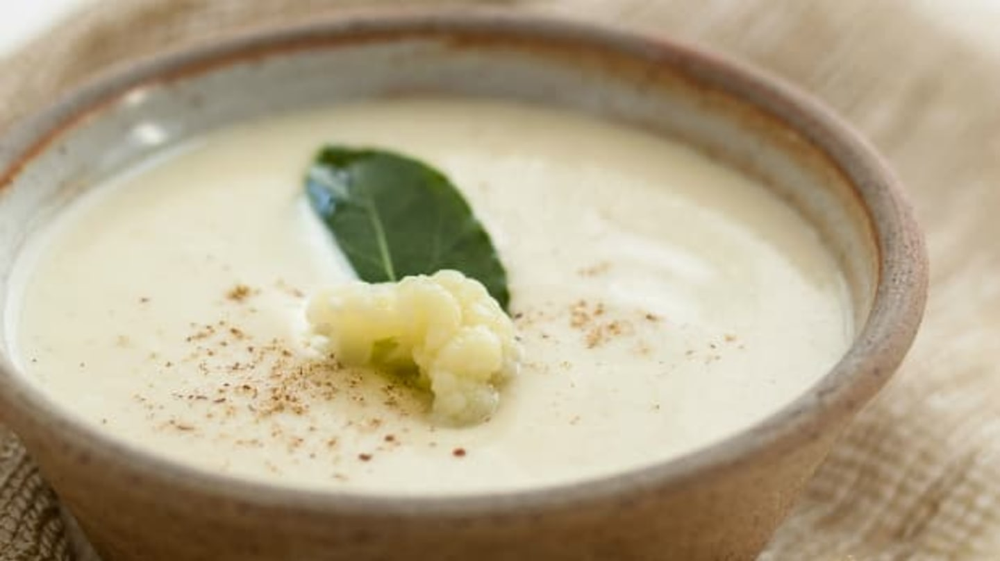

**Ingredience**

- 1 hlávka květáku
- 1 ks cibule
- 3 lžíce oleje
- 1 l zeleninového vývaru
- 1 lžíce olivového oleje
- 1 špetka soli
- 4 špetky hrubě mletého barevného pepře

**Postup**

1. Na oleji nechte zesklovatět nakrájenou cibuli. Orestovanou cibuli zalijte vývarem.
2. Omytý květák rozdělte na růžičky a dejte vařit do zeleninového vývaru.
3. Uvařenou polévku rozmixujte a podle chuti osolte.
4. Polévku před podáváním pokapejte olejem a posypte pepřem.

**Video**

<figure class="video_container">
  <iframe width="560" height="315" src="https://www.youtube.com/embed/l-0LA4cKNsw" frameborder="0" allow="accelerometer; autoplay; encrypted-media; gyroscope; picture-in-picture" allowfullscreen></iframe>
</figure>
