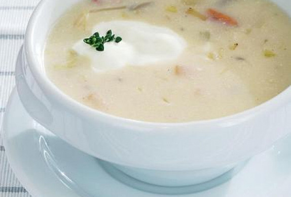

**Ingredience**

- 400 g kysané zelí
- 300 g brambory na kostičky
- bobkový list
- nové koření
- kmín
- sušené houby
- pepř mletý
- citron
- bylinky
- 30 g máslo
- 100 g cibule
- 100 g klobása pokrájená
- 100 g anglická slanina
- mléko
- 2 lžíce hladká mouka
- 150 g zakysaná smetana
- sůl
- moučkový cukr nemusí být (na dochucení)

**Postup**

1. Uvařte zelí s kmínem. V druhém kastrolku uvařte brambory, bobkový list, sůl, pepř, sušené houby, nové koření, kmín a bylinky. Až brambory změknou, vyndejte bylinky a vše slijte dohromady. Na másle osmažte cibuli, klobásu, anglickou slaninu a nakonec přidejte ještě hladkou mouku. Směs rozmíchejte s mlékem, nalijte k ostatním surovinám a za občasného míchání provařte asi dvacet minut. Nakonec přidejte zakysanou smetanu, dochuťte solí, pepřem a můžete také lehce přisladit moučkovým cukrem.
2. Zelí a brambory se dříve na stole objevovaly s železnou pravidelností, a tak není divu, že se připravovaly v tolika regionálních variantách. Platí to i o polévkách. Někde se jí říká zelňačka, jinde zelnica, na Valašsku je známá jako kyselica. Kromě základních surovin se do ní přidává také klobáska a zakysaná smetana.

**Video**

<figure class="video_container">
  <iframe width="560" height="315" src="https://www.youtube.com/embed/Jy-4bGseLBU" frameborder="0" allow="accelerometer; autoplay; encrypted-media; gyroscope; picture-in-picture" allowfullscreen></iframe>
</figure>
