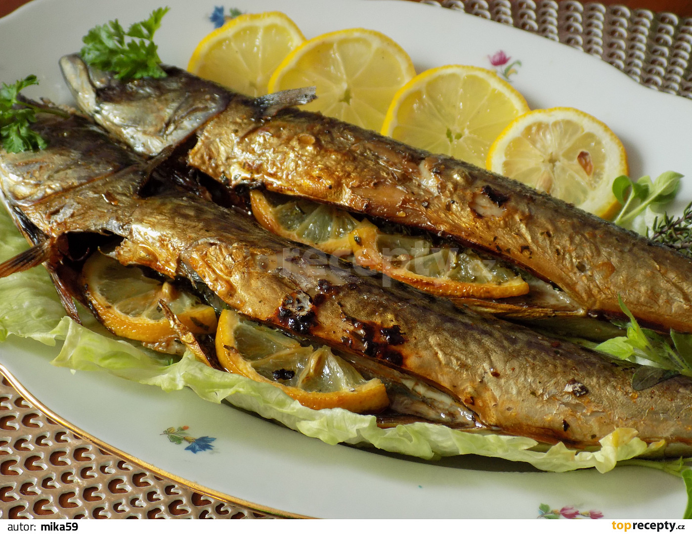

**Ingredience**

- 1 balení zmrazených makrel
- 2 kus Tomatové marinády s česnekem (od Avokáda)
- 1 kus koření Grilované ryby s citrónem (od Vitany)

**Postup**

1. Makrely rozmrazíme, odřízneme jim hlavy a pořádně propláchneme studenou vodou.
2. V nádobě, kde se budou ryby marinovat smícháme všechny sáčky s kořením, dobře promícháme a vložíme do ní příčně nakrojené makrely.
3. Marinádu pečlivě vetřeme i do zářezů, aby se dostala i dovnitř ryb a necháme přes noc v lednici odležet.
4. Pečeme v troubě na pečícím papíru asi na 180°C. Prvních 30 minut pečeme zakryté alobalem, nakonec jej sundáme a dopečeme odkryté.

**Video**

<figure class="video_container">
  <iframe width="560" height="315" src="https://www.youtube.com/embed/jQmHDPvQXI8" frameborder="0" allow="accelerometer; autoplay; encrypted-media; gyroscope; picture-in-picture" allowfullscreen></iframe>
</figure>
