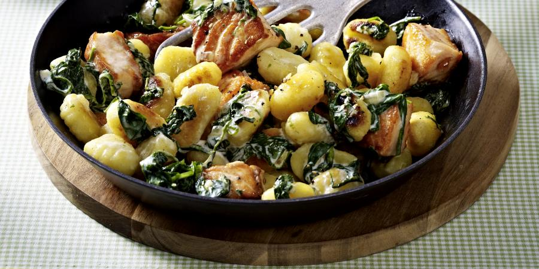

**Ingredience**

- 16 oz. potato gnocchi
- 2 Tbsp. unsalted butter
- 1 clove garlic, minced
- 2 Tbsp. flour
- 1.25 cups milk
- 3 cups fresh spinach, roughly chopped
- salt and pepper to taste
- 1 cup shredded parmesan cheese (if you’re a strict vegetarian, look for parmesan cheese made without rennet)

**Postup**

1. Cook the gnocchi according to package directions. Drain, set aside, and return the empty pot to the stove.
2. Melt butter over medium heat.
   3 Add garlic to butter and sauté for about a minute until garlic is fragrant.
3. Add flour to butter and whisk to form a roux. Cook for 30 seconds or so to cook out any raw flour taste.
4. Slowly add milk to roux, whisking constantly to break up any lumps. Cook for 2-3 minutes until sauce has just begun to thicken.
5. Stir chopped spinach into sauce and cook 3-5 minutes more until spinach has wilted and sauce has thickened.
6. Add salt and pepper to taste.
7. Remove pot from heat.
8. Add parmesan cheese to sauce and stir to combine.
9. Return cooked gnocchi to sauce and stir to combine. Serve immediately.

**Video**

<figure class="video_container">
  <iframe width="560" height="315" src="https://www.youtube.com/embed/IXYipqE54tw" frameborder="0" allow="accelerometer; autoplay; encrypted-media; gyroscope; picture-in-picture" allowfullscreen></iframe>
</figure>
