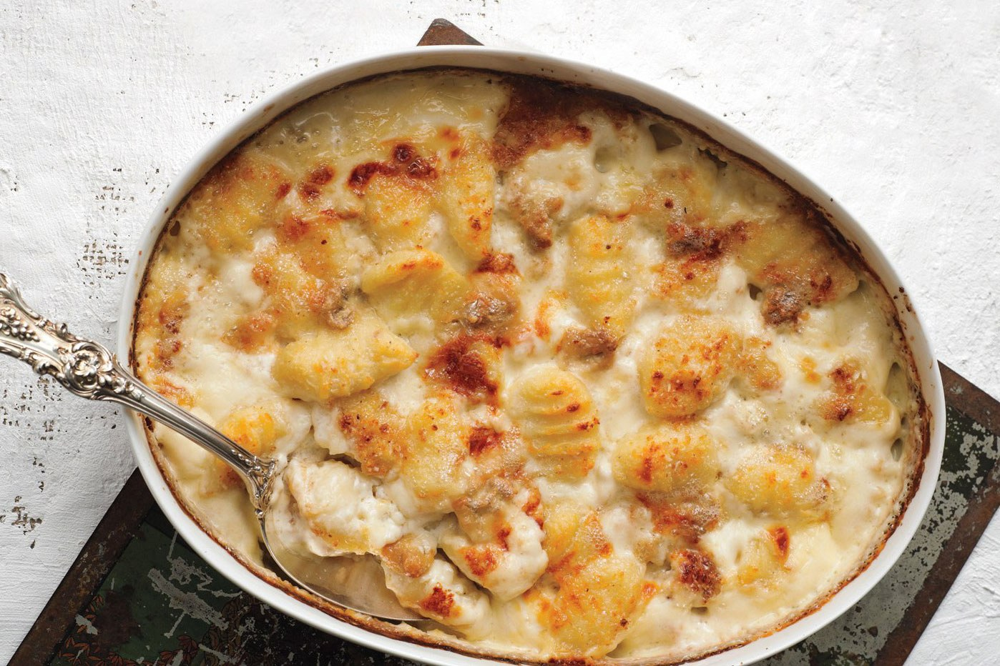

**Ingredience**

- Salt
- One 15-ounce container ricotta cheese, preferably whole milk
- 2 eggs, lightly beaten
- 1 ¼ cups freshly grated Parmesan, plus more for serving
- Freshly ground black pepper
- ¾ to 1 cup flour
- 3 tablespoons unsalted butter
- 10 or more sage leaves

**Postup**

1. Bring a large pot of water to a boil and salt it. Combine the ricotta, eggs and Parmesan in a large bowl, along with some salt and pepper. Add about 1/2 cup flour and stir; add more flour until the mixture forms a very sticky dough. Scoop up a spoonful of dough and boil it to make sure it will hold its shape; if it does not, stir in a bit more flour.
2. Put the butter in a large skillet over medium heat. When it melts and turns a nutty brown color, add the sage. While it fries, drop the ricotta mixture by the rounded tablespoon into the boiling water, working in batches of six or so at a time so as not to overload the pot.
3. When the gnocchi rise to the surface, remove with a slotted spoon and transfer to the skillet. When all the gnocchi are done, toss, taste and adjust the seasoning, and serve immediately.

**Video**

<figure class="video_container">
 <iframe width="560" height="315" src="https://www.youtube.com/embed/unAOVy92a_8" frameborder="0" allow="accelerometer; autoplay; encrypted-media; gyroscope; picture-in-picture" allowfullscreen></iframe>
</figure>
