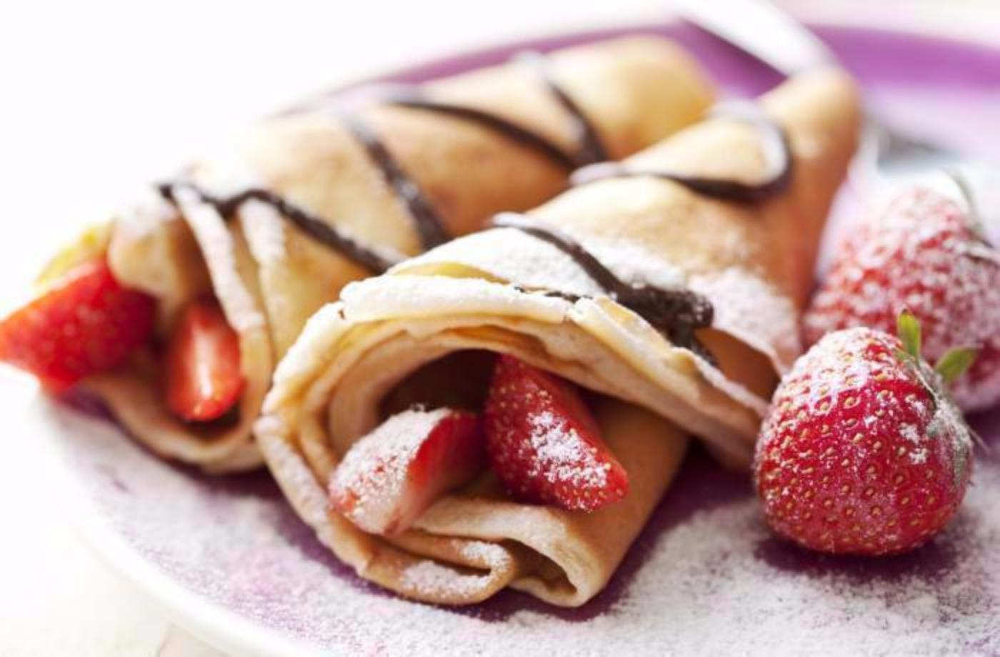

**Ingredience**

- sůl
- 300 g hladká mouka
- 2 ks vejce
- rostlinný olej
- 0,5 l mléko
- 1 balíček vanilkový cukr

**Postup**

1. Vše dobře rozmícháme ponorným mixérem na hladkou hmotu. Postupně smažíme po obou stranách na pánvi na lžičce oleje. Doporučuji používat speciální pánev na palačinky s nízkým okrajem a nepřilnavým povrchem.
2. Otáčíme nadhozením palačinky do vzduchu pomocí pánve, na kterou ji opět zachytíme (je to jednoduché). Tímto způsobem se zaručeně nepotrhá. Hotové palačinky potíráme marmeládou a zdobíme např. šlehačkou, ovocem atd.

**Video**

<figure class="video_container">
 <iframe width="560" height="315" src="https://www.youtube.com/embed/EkHTmH3kG74" frameborder="0" allow="accelerometer; autoplay; encrypted-media; gyroscope; picture-in-picture" allowfullscreen></iframe>
</figure>
