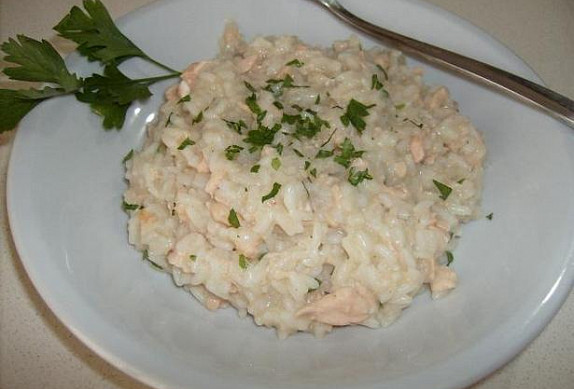

**Ingredience**

- 150 g rýže cca, ryze Arborio nebo Carnaroli, muze byt i Parboiled
- 1 ks filé z lososa 1 nebo 1 a 1/2
- 1 stroužek česnek
- 1 ks šalotka
- 50 ml bílé víno
- 500 ml zeleninový vývar cca
- panenský olivový olej
- máslo
- petrželka

**Postup**

1. File opláchneme, případně odstraníme kůži a nakrájíme na malé kousky. Šalotku nakrájíme na jemno.
2. V hrnci rozehrřejeme trochu oleje, kousek másla a dáme orestovat šalotku a oloupaný celý česnek, který potom odstraníme. Poté přidáme kousky lososa, chvíli restujeme, přidáme rýži (rýži neoplachujeme) a vše za stálého míchání opražíme dokud rýže nezprůsvitní. Zalijeme vínem, necháme odpařit a přidáme malé množství vařícího vývaru. Zmírníme oheň, promícháme a vždy, když se vývar odpaří a rýže zhoustne, přidáme další vývar. Takto pokračujeme dokud rýže není dostatečně měkká a má krémovitou konzistenci. Osolíme, ale pokud máme slaný vývar, tak již nesolíme. Odstavíme z ohně, přidáme lžíci másla, petrželku, promícháme a necháme odstát pár minut. Ihned podáváme, ozdobíme trochou petrželky, můžeme opepřit.
3. Rýži neoplachujeme abychom neodstranili škrob, který nám přispěje ke konečné krémovitosti rizota. Čerstvého lososa můžeme nahradit i uzeným.

**Video**

<figure class="video_container">
  <iframe width="560" height="315" src="https://www.youtube.com/embed/h3yXZi6aOeQ" frameborder="0" allow="accelerometer; autoplay; encrypted-media; gyroscope; picture-in-picture" allowfullscreen></iframe>
</figure>
