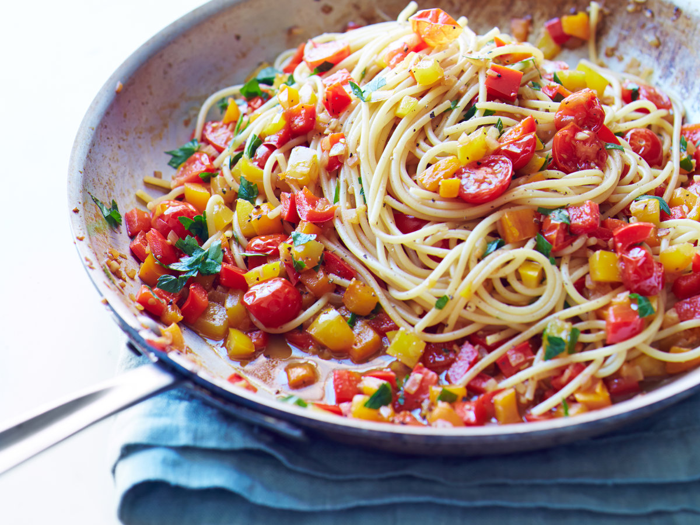

**Ingredience**

- 2-1/4 cups uncooked penne pasta
- 3/4 cup chopped onion
- 1 tablespoon olive oil
- 3 garlic cloves, minced
- 1 cup chopped sweet red pepper
- 1 cup chopped green pepper
- 1/4 cup sliced ripe olives
- 1 teaspoon dried oregano
- 1/4 teaspoon salt
- 1/8 teaspoon cayenne pepper
- 1/4 cup water
- 1/2 cup crumbled feta cheese

**Postup**

1. Cook pasta according to package directions. In a nonstick skillet, saute onion in oil for 1-1/2 minutes. Add garlic; cook 30 seconds longer. Add the sweet peppers; cook and stir for 2-3 minutes or until vegetables are tender. Stir in the olives, oregano, salt and cayenne. Add water; cook and stir until mixture comes to a boil. Drain pasta and stir into skillet. Remove from the heat. Stir in cheese. Serve immediately.

**Video**

<figure class="video_container">
 <iframe width="560" height="315" src="https://www.youtube.com/embed/VCAyX1qduc8" frameborder="0" allow="accelerometer; autoplay; encrypted-media; gyroscope; picture-in-picture" allowfullscreen></iframe>
</figure>
