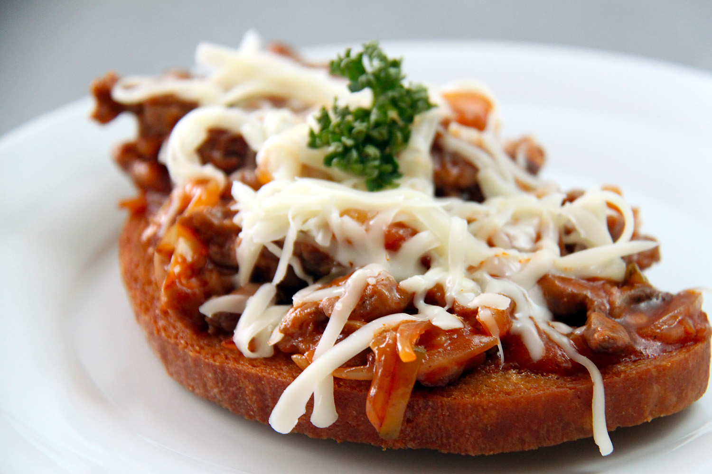

**Ingredience**

- 2 stroužky česneku, utřené nožem
- 75 g másla, změklého
- sůl
- krajíce den starého chleba

**Postup**

1. Česnek utřete nožem se solí a vmíchejte do změklého másla. Důkladně promíchejte.
2. Máslo poté na chvíli vraťte do lednice.
3. Chleby opečte na grilu nebo na pánvi, a pak potřete česnekovým máslem.

**Video**

<figure class="video_container">
<iframe width="560" height="315" src="https://www.youtube.com/embed/rYPxhJuT6ec" frameborder="0" allow="accelerometer; autoplay; encrypted-media; gyroscope; picture-in-picture" allowfullscreen></iframe>
</figure>
