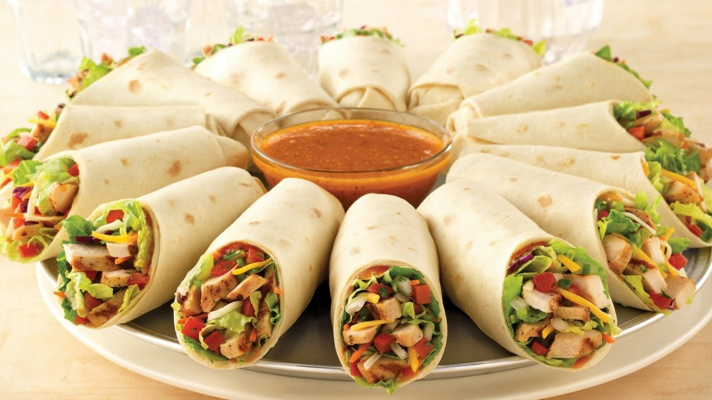

**Ingredience**

- 2 cups cooked grilled chicken breasts chopped (seasoned with your favorite spices, see note)
- 1/4 cup Hidden Valley® Simply Ranch dressing
- 1/2 cup mozzarella cheese
- 1/4 cup cilantro minced (optional)
- 4 8' tortillas

**Postup**

1. Lay tortillas on a clean flat surface. Place about 1/2 cup chicken, 1 tablespoon ranch, 2 tablespoons of cheese, and 1 tablespoon of minced cilantro on each tortilla. Fold tightly to form a burrito shape.
2. Heat a heavy-duty pan or grill to medium heat. Coat with a light layer or oil or cooking spray and cook wraps for 1-2 minutes on each side or until the tortilla is crispy and golden. Remove from heat, slice in half and serve immediately.

Recipe Notes
\*For the chicken: You can use cooked rotisserie chicken, leftover chicken, or grilled chicken seasoned with your favorite spices. I like to season my chicken with a tablespoon of fajita seasoning and grill in a hot pan for 5-6 minutes per side or until cooked through.

**Video**

<figure class="video_container">
 <iframe width="560" height="315" src="https://www.youtube.com/embed/GeDPFz4HRZU" frameborder="0" allow="accelerometer; autoplay; encrypted-media; gyroscope; picture-in-picture" allowfullscreen></iframe>
</figure>
