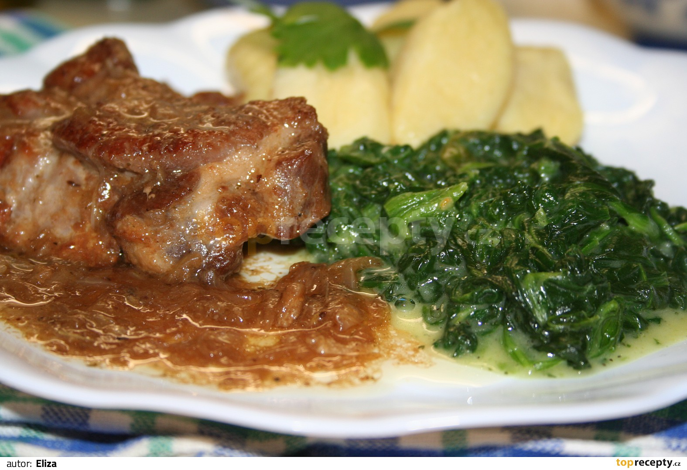

**Ingredience**

- 4 kotlety
- česnek
- cibule
- sůl
- pepř
- hl. mouka
- 1 kostka masoxu (nebo jiný vývar)

**Postup**

1. Kotlety naklepeme, okraje nařízneme. Kotlety osolíme, opepříme, potřeme rozetřeným česnekem a z jedné strany poprášíme hladkou moukou.
2. V kastrůlku rozpustíme kostku masoxu. Na vyšší pánvi rozehřejeme tuk, kotlety opečeme po obou stranách. Nejprve nepomoučněnou stranou.
3. Osmahnuté kotlety vyndáme na talíř a ve výpeku osmažíme nakrájenou cibuli. Vrátíme kotlety a podlijeme vývarem.
4. Pod pokličkou dusíme do měkka a postupně podléváme. Podáváme s bramborovým knedlíkem a podušeným špenátem (upraveným dle Vašeho způsobu).

**Video**

<figure class="video_container">
  <iframe width="560" height="315" src="https://www.youtube.com/embed/YWzSBY8j-Pg" frameborder="0" allow="accelerometer; autoplay; encrypted-media; gyroscope; picture-in-picture" allowfullscreen></iframe>
</figure>
