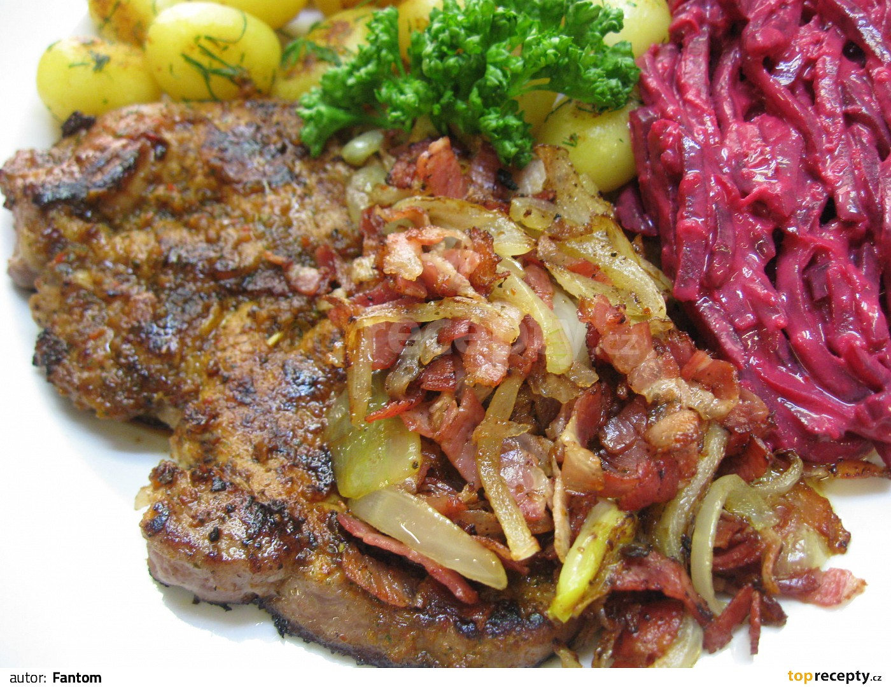

**Ingredience**

- Vepřová krkovice 150 g
- grilovací koření
- cibule 1 střední
- slanina 100 g
- olej

**Postup**

1. Vepřovou krkovičku okořeníme, lehce potřeme olejem a necháme hodinu odležet pod folií při pokojové teplotě.
2. Cibuli a slaninu nakrájíme na nudličky, krkovičku vložíme na rozpálenou pánev a když je z jedné strany opečená tak přidáme cibuli a slaninu, maso otočíme, zamícháme slaninu s cibulí aby se nám dobře opekla a necháme dodělat, podáváme s bramborem a zeleninou.

**Video**

<figure class="video_container">
 <iframe width="560" height="315" src="https://www.youtube.com/embed/rMXA9ifD5TI" frameborder="0" allow="accelerometer; autoplay; encrypted-media; gyroscope; picture-in-picture" allowfullscreen></iframe>
</figure>
