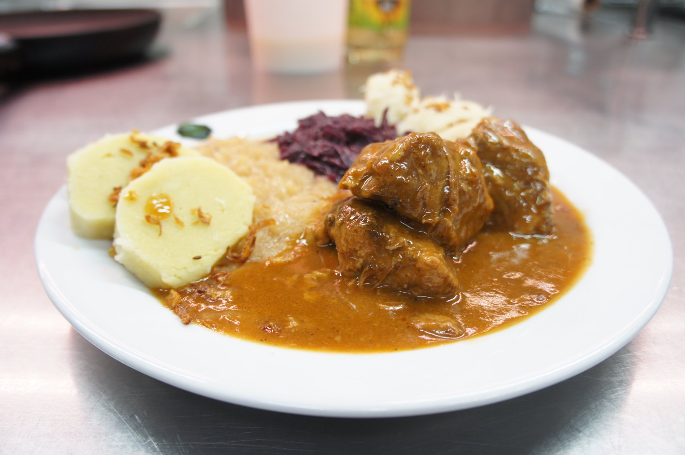

**Ingredience**

- 5OO g vepřové plece
- 2 stroužky česneku
- l l piva
- suchý chléb bez kůrek
- sůl
- 1/2 lžičky drceného kmínu
- muškátový květ
- citronová kůra

**Postup**

1. Jak Magdalena obyčejné a všední vaření pokládala. Pokrájej to vepřové maso na kousky, vlož do kastrolu, osol, přidej kmín a česnek utřený se solí.
2. Nalij tam to pivo a dej přikryté vařit. Když to napůl vařené jest, nastrouhej tam ten chlebíček tak, aby to příliš husté nebylo.
3. Přidej květ a citronovou kůru a vař jen tak, aby to převařené nebylo. Omáčka zdá se Ti hustá příliš býti, přidej pivo, nebo dobrou polívku.
4. Na mísu jest uvařeno nandej a k tomu podávej brambory nebo rýži dobře vařenou. Také chlebíček se k tomu jídlu ve všední den podávati může.

**Video**

<figure class="video_container">
 <iframe width="560" height="315" src="https://www.youtube.com/embed/CyCHnAdh9bg" frameborder="0" allow="accelerometer; autoplay; encrypted-media; gyroscope; picture-in-picture" allowfullscreen></iframe>
</figure>
