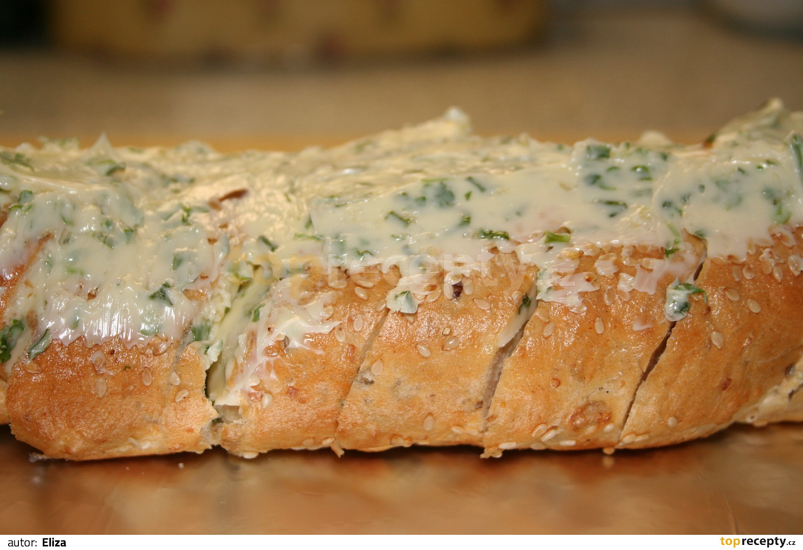

**Ingredience**

- 1 velká bageta
- 150 g másla
- 3 stroužky česneku
- 2 lžíce nasekaných bylinek dle individuální chuti (nejlépe pažitka, petrželka, bazalka)
- trochu soli

**Postup**

1. Změklé máslo smícháme se špetkou soli, prolisovaným česnekem a nasekanými čerstvými bylinkami.
2. Bagetu nakrájíme na příčné plátky široké cca 2 cm, ale řezy úplně nedokončíme. Bageta tak zůstane vcelku.
3. Do každého zářezu vetřeme jednu lžičku bylinkového másla a zbytkem potřeme povrch bagety (viz. foto).
4. Bagetu těsně zabalíme do alobalu, vložíme do trouby rozehřáté na 180°C a pečeme 10 minut.
5. Poté obrátíme, pečeme 5 minut, nato zvrchu odhrneme alobal a dalších 5 minut dopečeme dokřupava.
6. Rozkrájíme a podáváme teplé k pečenému nebo grilovanému masu, obloženým talířům, zeleninovým salátům, naloženým sýrům nebo jen tak samostatně, třeba k bílému vínu.

**Video**

<figure class="video_container">
 <iframe width="560" height="315" src="https://www.youtube.com/embed/ebQr-yScslw" frameborder="0" allow="accelerometer; autoplay; encrypted-media; gyroscope; picture-in-picture" allowfullscreen></iframe>
</figure>
