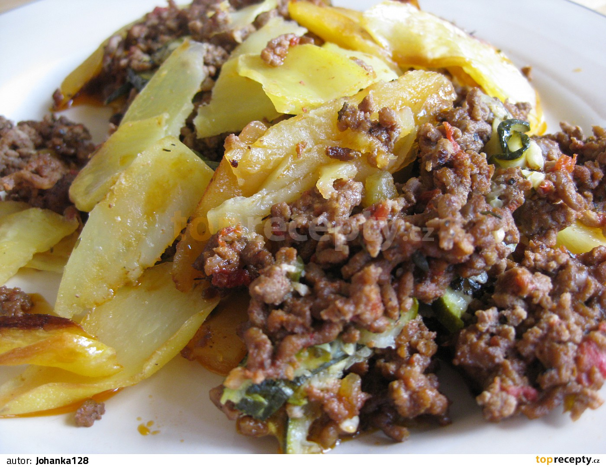

**Ingredience**

- 1 kg brambor
- 500 g mletého masa ( směs vepřového a hovězího )
- 200 g eidamu
- 2 vejce
- 2 starší rohlíky
- trochu mléka
- 1 kelímek sladké (31%) smetany
- sůl
- barevný pepř
- sušený česnek
- olej

**Postup**

1. Do mletého masa nastrouháme sýr, přidáme vejce a kousky rohlíků, které jsme nechali změknout v trošce vlažného mléka. Mírně osolíme a opepříme a pořádně promícháme.
2. Oloupané brambory nakrájíme na slabé plátky a polovinou jejich množství vyskládáme dno olejem vymazané zapékací nádoby.
3. Posypeme solí, pepřem a sušeným česnekem. Zalijeme je polovinou kelímku smetany a navrch rozprostřeme masovou směs. Kdyby to šlo obtížně, pomůžeme si rukama, namočenýma ve studené vodě.
4. Masovou směs poklademe zbytkem brambor, které opět osolíme, opepříme a posypeme česnekem.
5. Zalijeme zbylou smetanou a zapečeme v troubě, vyhřáté na 160 stupňů asi hodinku do zlatova.

**Video**

<figure class="video_container">
 <iframe width="560" height="315" src="https://www.youtube.com/embed/A-22hYY-svQ" frameborder="0" allow="accelerometer; autoplay; encrypted-media; gyroscope; picture-in-picture" allowfullscreen></iframe>
</figure>
