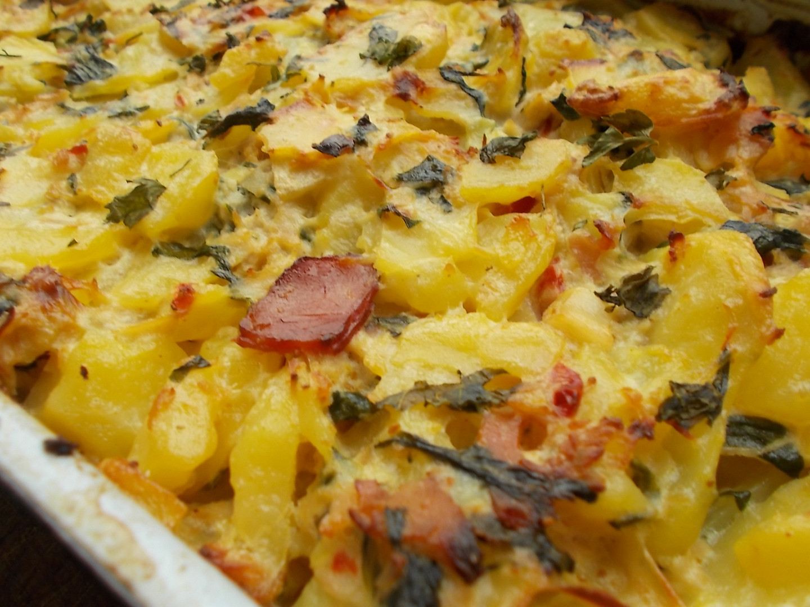

**Ingredience**

- brambory uvařené ve slupce
- olivový olej
- cibule
- česnek
- uzené maso
- smetana
- sůl
- pepř
- máslo
- vejce
- mléko

**Postup**

1. Na pánvi na oleji osmahneme nakrájenou cibuli, přidáme česnek a po chvilce přidáme uzené maso. Po orestování přilijeme smetanu, osolíme (není nutné - já nesolím), opepříme a krátce povaříme, aby smetana trochu zhoustla.
2. Zapékací formu vymažeme máslem a klademe do ní vrstvy na plátky nakrájených vařených a oloupaných brambor a smetanové omáčky s uzeným masem. Poslední vrstva je bramborová. Pečeme v předehřáté troubě na 180°C asi 10-15 min.
3. Potom brambory zalijeme vejci rozmíchanými s trochou mléka. Pečeme dalších cca 15 min., až se udělá křupavá kůrčička. Dobrou chuť.

**Video**

<figure class="video_container">
 <iframe width="560" height="315" src="https://www.youtube.com/embed/jfcVkBMvrc0" frameborder="0" allow="accelerometer; autoplay; encrypted-media; gyroscope; picture-in-picture" allowfullscreen></iframe>
</figure>
