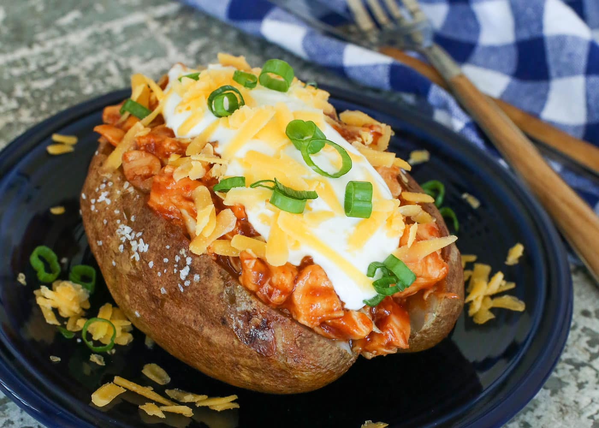

**Ingredience**

- 3 large baking potatoes (1 pound each)
- 1-1/2 teaspoons canola oil, optional
- 1/2 cup sliced green onions
- 1/2 cup butter, cubed, divided
- 1/2 cup half-and-half cream
- 1/2 cup sour cream
- 1 teaspoon salt
- 1/2 teaspoon white pepper
- 1 cup shredded cheddar cheese
- Paprika

**Postup**

1. Scrub and pierce potatoes. Rub with oil if desired. Bake at 400° for 50-75 minutes or until tender. When cool enough to handle, cut each potato in half lengthwise. Scoop out pulp, leaving a thin shell; set aside.
2. In a small skillet, saute onions in 1/4 cup butter until tender. In a large bowl, mash potato pulp. Stir in onion mixture, cream, sour cream, salt and pepper. Fold in cheese. Stuff into potato shells.
3. Place on a baking sheet. Melt remaining butter; drizzle over potatoes. Sprinkle with paprika. Bake at 375° for 20 minutes or until heated through.

Editor's Note: Potatoes may be stuffed ahead of time and refrigerated or frozen. Allow additional time for reheating.

Test Kitchen Tips
White pepper is milder than black pepper, but use whichever you prefer or happen to have on hand.
We're obsessed with the deep rich flavor of smoked paprika; it just may be the bacon of the spice world. Try it here. It really sets off the cheesy topping!

**Video**

<figure class="video_container">
 <iframe width="560" height="315" src="https://www.youtube.com/embed/nBpxVdpMBZk" frameborder="0" allow="accelerometer; autoplay; encrypted-media; gyroscope; picture-in-picture" allowfullscreen></iframe>
</figure>
