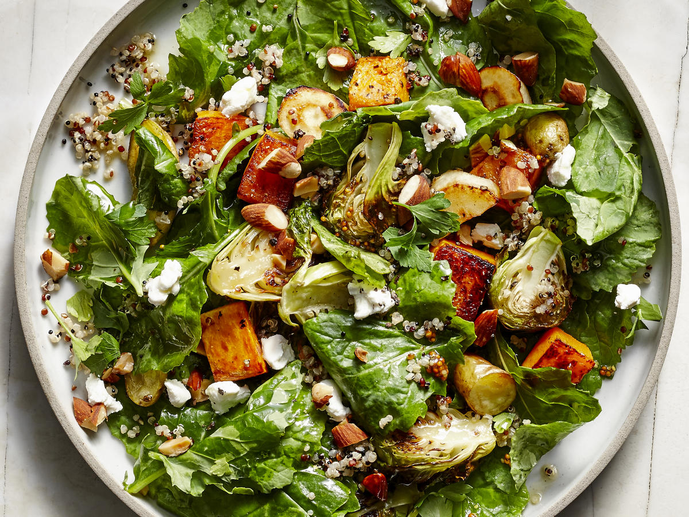

**Ingredience**

Salad

- 10 ounces chopped romaine lettuce\* (about 2 medium or 3 small heads, chopped)
- ½ medium head of radicchio\*, finely chopped (about 2 cups)
- ½ medium red onion, chopped (about 1 cup)
- 2 ribs celery, chopped
- 1 pint cherry tomatoes, thinly sliced
- ⅓ cup stemmed and thinly sliced pickled pepperoncini peppers
- ⅓ cup oil-packed sun-dried tomatoes, rinsed and roughly chopped
- 1 can (15 ounces) chickpeas, rinsed and drained, or 1 ½ cups cooked chickpeas
- 1 cup (4 ounces) ¼″ cubes of provolone cheese (optional)

Italian vinaigrette

- ⅓ cup extra-virgin olive oil
- ⅓ cup red wine vinegar
- 1 tablespoon Dijon mustard
- 1 teaspoon honey
- 2 cloves garlic, pressed or minced
- 2 teaspoons dried oregano
- 10 twists freshly ground black pepper
- ¼ teaspoon salt, more to taste
- Pinch of red pepper flakes, for heat (optional)

**Postup**

1. In a large serving bowl, combine the chopped lettuce, radicchio, onion, celery, cherry tomatoes, peppers, sun-dried tomatoes, chickpeas and cheese (if using). Toss the ingredients together and set aside.
2. To prepare the dressing, combine all of the ingredients in a liquid measuring cup. Whisk until blended. Taste, and add more salt if the dressing doesn’t knock your socks off (I usually add one to two more pinches of salt).
3. If you’ll be serving all of the salad at once, go ahead and drizzle enough dressing in to lightly coat the salad and toss to combine. I prefer to store the salad and dressing separately so I can enjoy salad for a few days. Just whisk the dressing again before drizzling (if the olive oil solidifies a bit in the refrigerator, don’t worry, that’s normal—just let it warm up for about 5 minutes at room temperature or microwave for 10 to 20 seconds).

**Video**

<figure class="video_container">
  <iframe width="560" height="315" src="https://www.youtube.com/embed/AJb9GpR_dgQ" frameborder="0" allow="accelerometer; autoplay; encrypted-media; gyroscope; picture-in-picture" allowfullscreen></iframe>
</figure>
