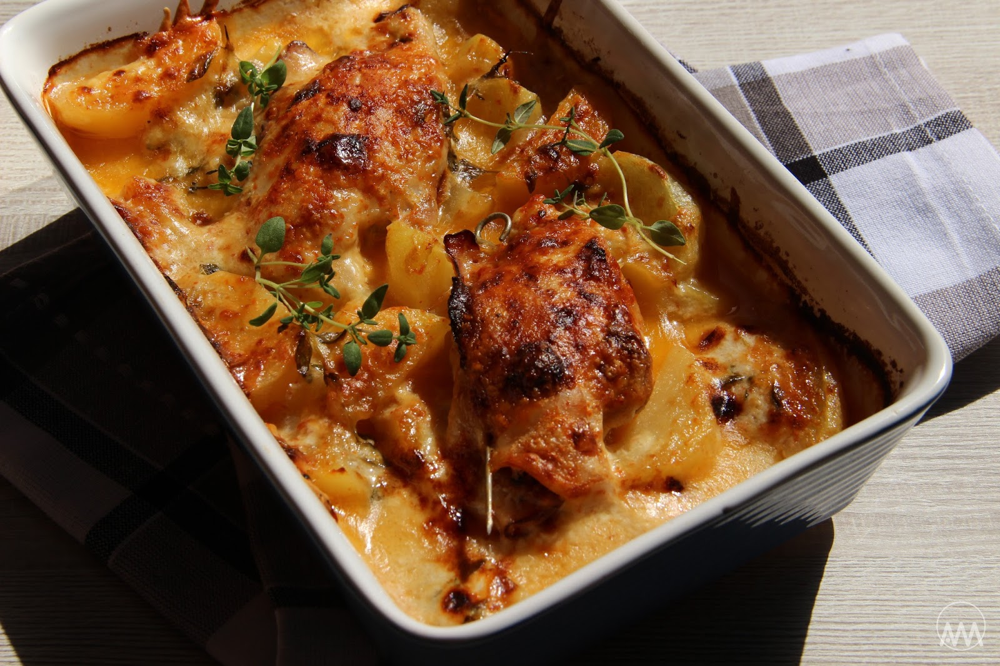

**Ingredience**

- 3 kuřecí prsa (dle porcí)
- 1 smetana
- 1 vajíčko
- 10-15 dkg Eidamu
- 4 plátky šunky
- 1 cibule
- 1 rajče
- 1/2 čerstvé papriky
- trošku hladké mouky
- sůl
- pepř
- grilovací koření

**Postup**

1. Kuřecí prsa naklepeme, osolíme, opepříme, dle chuti přidáme koření (např. grilovací), zaprášíme hladkou moukou a osmahneme na pánvi na másle, popř. trošce oleje dozlatova.
2. Připravíme si zapékací misku, vymažeme ji máslem, vložíme osmažené prsa, nakrájíme papriku, rajče a cibuli a přidáme do misky. Na prsa položíme plátky šunky a vložíme do trouby.
3. Postupně přidáváme vodu, aby se ze zeleniny a masa pustila šťáva a asi po 25-30 minutách směs polijeme smetanou smíchanou s vajíčkem a posypeme nastrouhaným sýrem. Necháme zapéct asi ještě 20-30 minut.

**Video**

<figure class="video_container">
 <iframe width="560" height="315" src="https://www.youtube.com/embed/3-bifgxG58w" frameborder="0" allow="accelerometer; autoplay; encrypted-media; gyroscope; picture-in-picture" allowfullscreen></iframe>
</figure>
