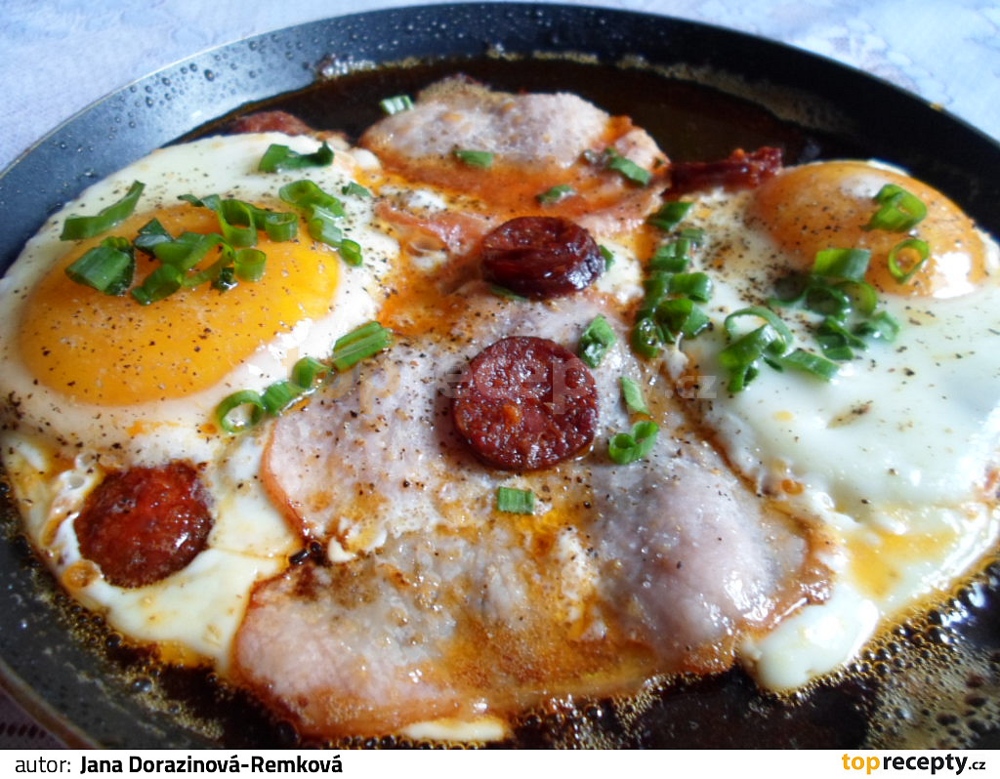

**Ingredience**

- 50 g šunka
- sůl
- 2 ks vejce
- pepř mletý
- olej

**Postup**

1. Na pánvi si rozehřejeme olej a po celé ploše rozložíme na plátky nakrájenou šunku, kterou propečeme. Navrch rozklepneme vejce a bez míchání je zahřejeme. Necháme bílek ztuhnout (můžeme na chvíli přikrýt pokličkou). Osolíme, opepříme a podáváme s čerstvým pečivem.

**Video**

<figure class="video_container">
  <iframe width="560" height="315" src="https://www.youtube.com/embed/gTpqutgqKQ4" frameborder="0" allow="accelerometer; autoplay; encrypted-media; gyroscope; picture-in-picture" allowfullscreen></iframe>
</figure>
