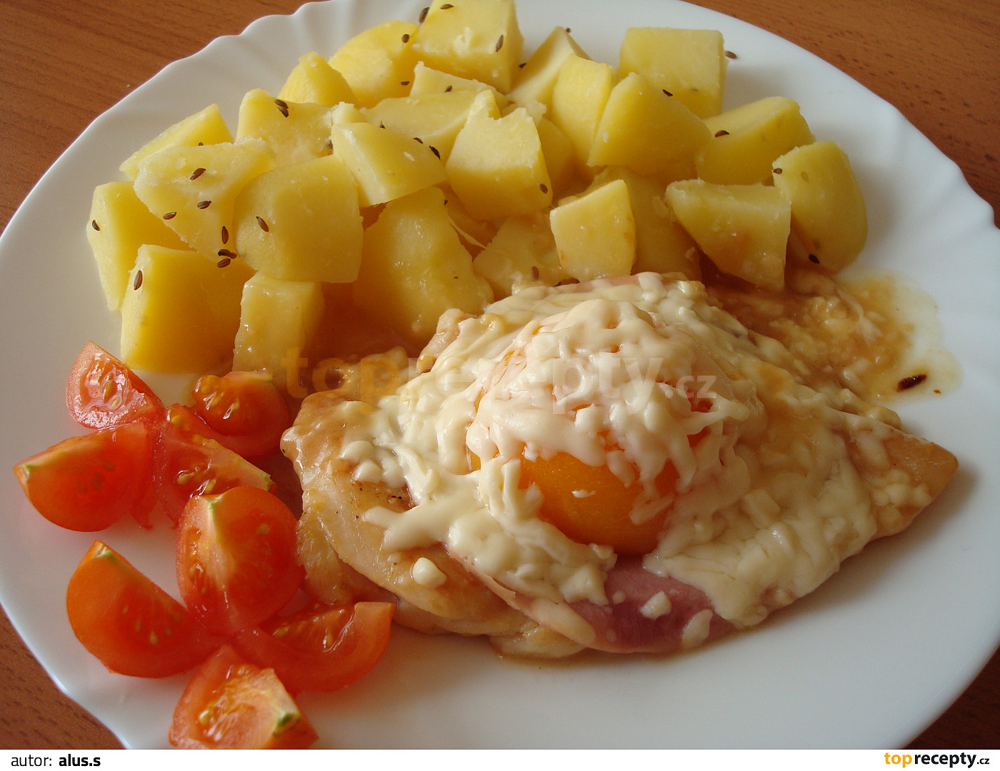

**Ingredience**

- 250 - 300 g kuřecích prsou (2 plátky)
- sůl
- 2 větší špetky kari koření
- 1/2 až 1 zarovnaná malá lžička hladké mouky
- 1 - 2 lžíce oleje 2 plátky šunky
- zhruba 50 g strouhaného tvrdého sýra
- 2 pevnější poloviny kompotované broskve trochu drůbežího vývaru (pokud máme)

**Postup**

1. Kuřecí prsa mírně naklepeme, osolíme a trošku poprášíme kari kořením. Plátky masa prudce opečeme po obou stranách na pánvičce s horkým olejem, maso vyjmeme, výpek zaprášíme hladkou moukou, chvíli orestujeme a za stálého prošlehávání nebo míchání zalijeme drůbežím vývarem nebo vodou. Mouky si dáme méně nebo více podle toho, kolik chceme mít šťávy.
2. Když nám šťáva začne vařit, tak dáme zpět maso a necháme ho chvíli na mírném plameni dohotovit. Ke konci přípravy dáme na maso plátek šunky a prohřátou polovinu kompotované broskve(prohřejeme přímo ve šťávě společně s masem nebo v mikrovlné troubě), zasypeme tvrdým strouhaným sýrem a přikryjeme pokličkou, sýr se mírně rozpustí a ihned podáváme.

**Video**

<figure class="video_container">
  <iframe width="560" height="315" src="https://www.youtube.com/embed/bJ24nTk52Qg" frameborder="0" allow="accelerometer; autoplay; encrypted-media; gyroscope; picture-in-picture" allowfullscreen></iframe>
</figure>
