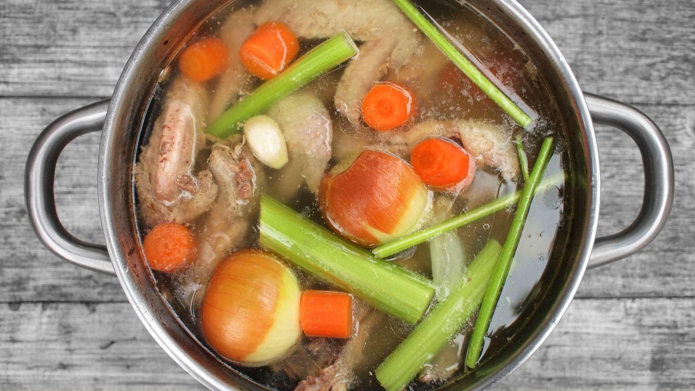

**Ingredience**

- 4 l vody
- 2 kg kuřecích kostí, křídel a drobů
- 300 g zeleniny (cibule, mrkev, celer, petržel, česnek)

**Postup**

1.  Kuřecí kosti neumývejte ve dřezu a dejte je rovnou do hrnce s odměřenou studenou vodou. Vodu přiveďte pod bod varu (s teplotou okolo 90 °C).
2.  V první hodině seberte z povrchu vývaru nečistoty (vysrážené bílkoviny). Nemusíte být super důslední a klidně vyčkejte, až se jich nashromáždí více. Seberte je pak najednou nebo nadvakrát pěnovačkou nebo lžící. Sbírání nečistot má kosmetický účel – vývar bez nich je čistější.
3.  Po dvou hodinách přidejte očištěnou zeleninu a pokračujte ještě alespoň hodinu. Vývar bude dobrý už za tři hodiny. Pokud máte čas navíc, můžete vaření natáhnout až na 6 hodin.
4.  Hotový vývar sceďte přes jemný cedník. Rozdělte do nádob (ideálně po 0,5 l) a nechte vychladnout. Zakryjte a uchovejte v lednici (pár dní) nebo v mrazáku (několik týdnů).

**Video**

<figure class="video_container">
  <iframe width="560" height="315" src="https://www.youtube.com/embed/74tZ-yOOPy0" frameborder="0" allow="accelerometer; autoplay; encrypted-media; gyroscope; picture-in-picture" allowfullscreen></iframe>
</figure>
