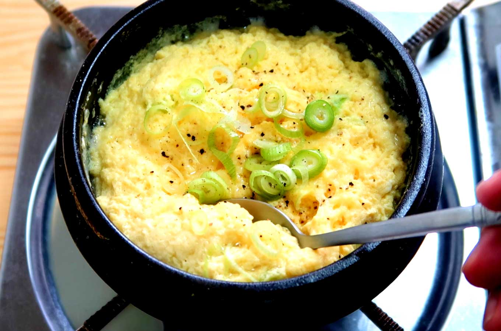

**Ingredience**

- 4 large eggs, divided
- 2 tablespoons olive oil or canola, divided\*
- 1 cup diced red onion (about 1 small onion)\*\*
- 1 1/3 cups frozen mixed vegetables, thawed
- 3 stalks of scallions, sliced
- 4 cups cooked brown jasmine rice\*\*\*
- 2 tablespoons soy sauce (use tamari if gluten free)
- 1 teaspoon toasted sesame oil (optional)

**Postup**

1. Crack 3 eggs into a small bowl and beat them together. Beat the last egg in a separate bowl.
2. Heat a large sauté pan or a wok with 1/2 tablespoon of the olive oil over medium-high heat. Once the pan is hot, add the 3 beaten eggs and scramble them for about a minute. Transfer the eggs to a dish and turn off the heat. Wipe off the pan or wok with a kitchen towel.
3. Drizzle the remaining 1 1/2 tablespoons of oil in the pan or wok over medium-high heat. Add the onions and cook them for about 2 minutes, stirring constantly. Add the mixed vegetables and scallions and cook for another minute. I like to save some of the scallions (the dark green part) for garnish.
4. Add the cooked rice into the pan or wok and cook for a few minutes, until the rice is heated through. If you have large clumps of rice, break them apart with the back of your spatula. Pour the single beaten egg over the rice and stir to coat the rice with the egg. Cook for another minute.
5. Add the soy sauce and sesame oil (if using) and stir to distribute the sauces. Add the 3 scrambled eggs and stir to mix again. Serve immediately.
   **Video**

<figure class="video_container">
  <iframe width="560" height="315" src="https://www.youtube.com/embed/1aLY3qxovAU" frameborder="0" allow="accelerometer; autoplay; encrypted-media; gyroscope; picture-in-picture" allowfullscreen></iframe>
</figure>
