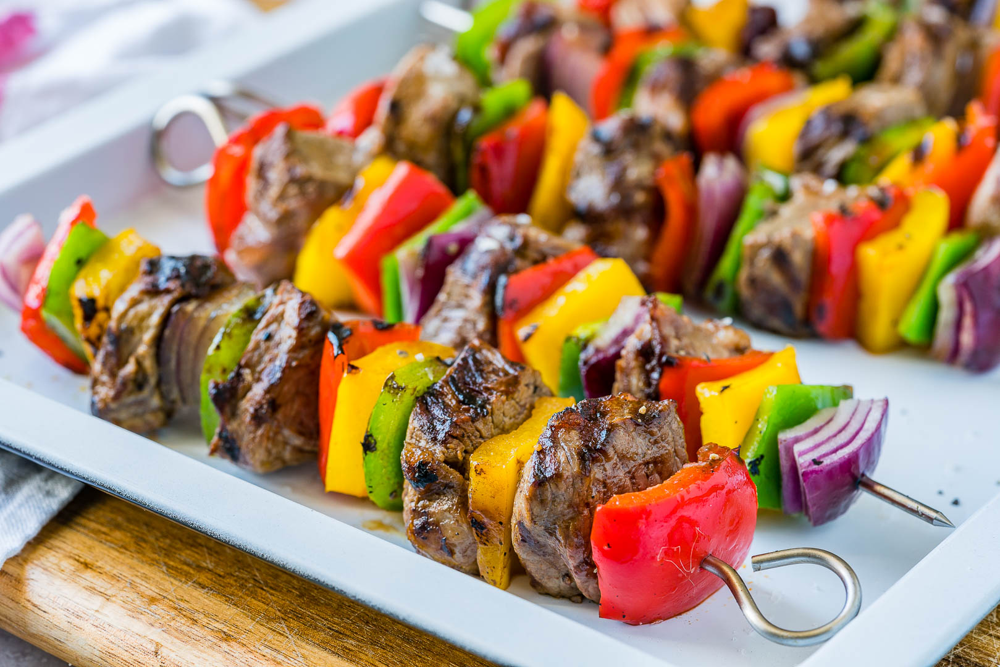

**Ingredience**

Marinade

- 1/4 c olive oil
- 1/4 c soy sauce
- 1 1/2 tbsp fresh lemon juice
- 1 1/2 tbsp red wine vinegar
- 2 1/2 tbsp Worcestershire sauce
- 1 tbsp honey
- 2 tsp Dijon
- 1 tbsp garlic
- 1 tsp freshly ground black pepper
  Kebabs
- 1 3/4 lbs sirloin steak (look for thicker steaks), cut into 1 1/4 inch pieces
- 8 oz button or cremini mushrooms, halved (unless small, keep whole)
- 3 bell peppers (1 red, 1 green, 1 yellow) cut into 1 1/4-inch pieces
- 1 large red onion diced into chunks (about 1 1/4-inch)
- 1 Tbsp olive oil, plus more for brushing grill grates
- Salt and freshly ground black pepper
- 1/2 tsp garlic powder
- 10 wooden skewer sticks soaked in water for at least 30 minutes

**Postup**

1. For the marinade: In a mixing bowl whisk together all marinade ingredients.

2. For the kebabs: place steak into a gallon size resealable bag. Pour marinade over steak then seal bag while pressing out excess air and message marinade over steak. Transfer to refrigerator and allow to marinate 3 - 6 hours.

3. Preheat a grill over medium-high heat to about 425 degrees (partway through preheating clean grill grates if they aren't already clean).

4. With veggies on cutting board, drizzle with oil and lightly toss to coat (I actually don't toss the onion because I like it to stay in chunks, when you thread the onion on layer in chunks about 2 - 3 slices so they don't burn up).

5. Sprinkle veggies evenly with garlic powder and season with salt and pepper. To assemble kebabs layer steak and veggies onto kebabs in desired order, work to fit 4 steak pieces onto each kebab (I like to layer 2 onion slices together).

6. Brush grill grates lightly with oil. Place kebabs on grill and grill until center of steak registers about 140 - 145 degrees for medium doneness, turning kebabs occasionally, about 8 - 9 minutes. Serve warm.

**Video**

<figure class="video_container">
 <iframe width="560" height="315" src="https://www.youtube.com/embed/vHSmOI7Z_5M" frameborder="0" allow="accelerometer; autoplay; encrypted-media; gyroscope; picture-in-picture" allowfullscreen></iframe>
</figure>
