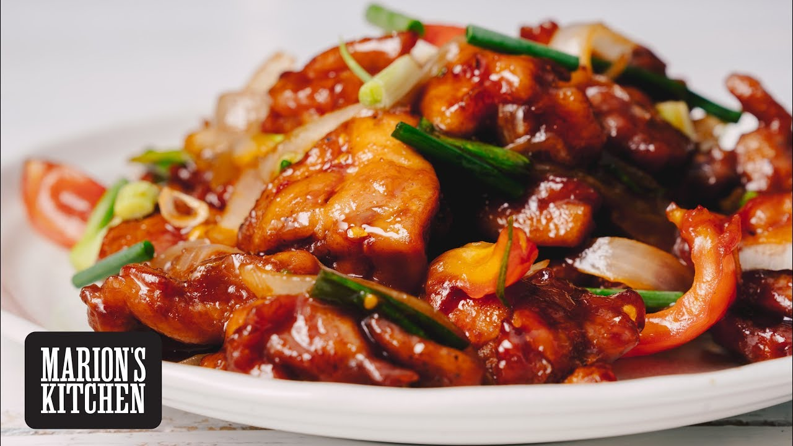

**Ingredience**

- 680.39 g chicken breasts cut into 1” chunks
- 64 g cornstarch
- 2 eggs beaten
- 31.25 g flour
- canola oil for frying
- 566 g pineapple chunks
- 1 red bell pepper cut into 1” chunks
- 1 green bell pepper cut into 1” chunks
- 0.5 yellow onion cut into 1” chunks
- 100 g sugar
- 55 g brown sugar
- 119.5 g apple cider vinegar
- 80 g ketchup
- 4 teaspoons reduced sodium soy sauce
- 2 cloves garlic minced

**Postup**

1. To make the sauce, whisk together the sugar, brown sugar, apple cider vinegar, ketchup, soy sauce and garlic into a small bowl.
2. Pour enough canola oil into a dutch oven or frying pan that is comes up from the bottom about an inch to an inch and a half.
3. Heat the oil on medium high to high heat, you’re looking for the chicken to cook and brown in about 2-3 minutes.

4. Add the cornstarch to a large ziplock bag.
5. Add the chicken pieces to the large ziplock bag and shake until all the pieces are well coated.
6. Dip the pieces into the egg, then into the flour before adding to the hot oil.
7. Cook the chicken for 2-3 minutes, until cooked through and crispy.

8. Remove to a cookie sheet (no paper towels!) and continue cooking all the chicken pieces.
9. When done cooking remove all but a tablespoon of the oil.
10. Add the bell peppers, onion and pineapple and cook for 1-2 minutes, until crisp-tender.

11. Add the sauce back in and stir to coat the pieces and cook for 30 seconds to help the garlic warm through

12. Add the chicken pieces back in and stir until the sauce has thickened and bubbling.
13. Serve immediately, with optional garnishes of sesame seeds or green onions.

**Video**

<figure class="video_container">
 <iframe width="560" height="315" src="https://www.youtube.com/embed/hKkGDwi8plE" frameborder="0" allow="accelerometer; autoplay; encrypted-media; gyroscope; picture-in-picture" allowfullscreen></iframe>
</figure>
