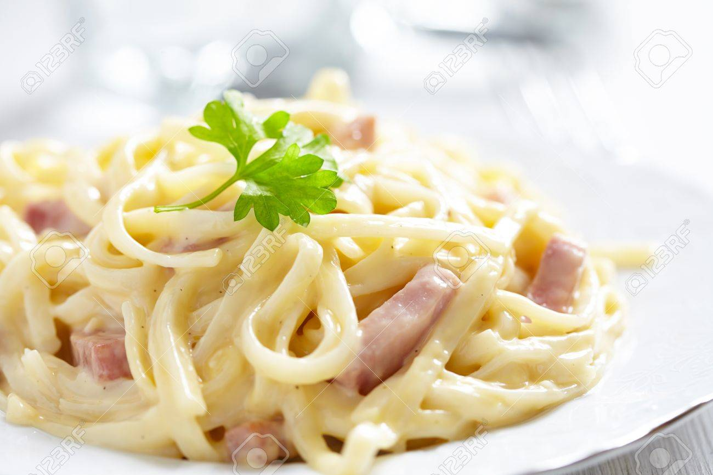

**Ingredience**

- 350g dried tagliatelle
- 280g pack Tesco No Added Water Cooked Ham, sliced
- 1tbsp olive oil
- 1 small onion, finely chopped
- 2 garlic cloves, crushed
- 125ml white wine
- 200ml single cream
- ½ pack chives, snipped
- black pepper
- parmesan

**Postup**

1. Bring a large pan of water to the boil and cook the pasta as instructed on the pack. Meanwhile heat the oil in a large frying pan over a medium high heat and cook the onion and garlic for 8 – 10 minutes until softened.
2. Add the wine to the pan and bubble for a minute, then stir in the cream and bring just to the boil. Stir the ham into the cream sauce and heat for a minute.
3. Drain the cooked pasta and add to the sauce with the snipped chives and a good grinding of black pepper. Serve with parmesan to grate over.

**Video**

<figure class="video_container">
 <iframe width="560" height="315" src="https://www.youtube.com/embed/hN4yoz7Nz-g" frameborder="0" allow="accelerometer; autoplay; encrypted-media; gyroscope; picture-in-picture" allowfullscreen></iframe>
</figure>
